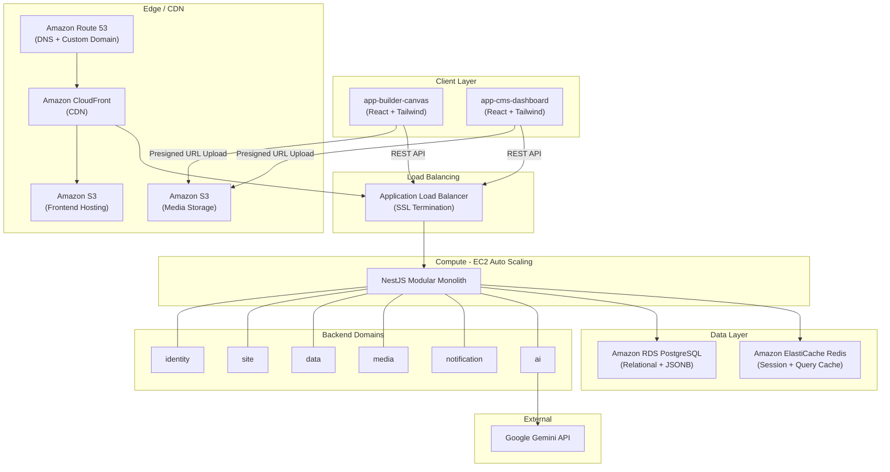

# Architecture Design

## Overview

Genzite is an AI-Powered No-Code Business Application Builder & Dynamic CMS. The system follows a **Modular Monolith** architecture with strict domain boundaries.

## System Topology



## Repository Structure

```
genzite/
├── .ai/                     # Mandatory AI agent rules & guardrails
│   ├── 01-architecture.md
│   ├── 02-backend-rules.md
│   ├── 03-frontend-rules.md
│   └── 04-qa-rules.md
├── backend/                 # NestJS Modular Monolith
│   └── src/
│       ├── identity/        # Auth, JWT, RBAC
│       ├── site/            # Site canvas, pages, widgets
│       ├── data/            # Dynamic CMS collections & records (JSONB)
│       ├── media/           # S3 Presigned URL generation
│       ├── notification/    # Email, webhooks, push
│       └── ai/              # Google Gemini integration
├── frontend/                # React + Vite + TypeScript + Tailwind CSS
│   └── src/
│       ├── components/      # Reusable UI components
│       ├── pages/           # Route-level views
│       ├── hooks/           # Custom React hooks
│       ├── context/         # Global state providers
│       └── services/        # API client layer
├── infra/                   # Docker Compose for local development
├── docs/                    # Product spec, DB design, API contracts
├── qa/                      # Functional API verification scripts
└── .cursorrules             # AI agent entry-point directive
```

## Modular Monolith Guardrails

### Domain Isolation
Each backend domain (`identity`, `site`, `data`, `media`, `notification`, `ai`) is a self-contained NestJS Module. Domains must:
- **Export only interfaces/abstractions**, not concrete services.
- **Never inject concrete classes** from another domain.
- **Communicate cross-domain** via NestJS EventEmitter (application events) or exported interfaces only.

### LLM Isolation
The `ai` module handles Google Gemini API calls which may take 10–15 seconds. This module must be logically isolated so that long-running AI calls never block core CRUD operations in other domains.

### Media Upload Path
Media file uploads **bypass the backend entirely**. The `media` module only generates **Presigned URLs** for Amazon S3. The frontend uploads directly to S3 using those URLs, then notifies the backend of the completed upload via a metadata callback endpoint.

### Data Layer Split
| Data Type | Storage Strategy |
|---|---|
| System config, Users, Roles, Permissions, Site metadata | Standard PostgreSQL relational tables |
| User-generated CMS content, dynamic business objects, resume data | PostgreSQL `JSONB` columns |

> **RULE**: NEVER create fixed SQL columns or migrations for dynamic user data fields. All dynamic content MUST use JSONB.

## Design Philosophy

The UI/UX aesthetic MUST be **cozy, user-friendly, and home-oriented**. Strictly reject harsh, technical, or traditional IT-dashboard designs. The platform should feel like a welcoming community tool, not a developer console.
