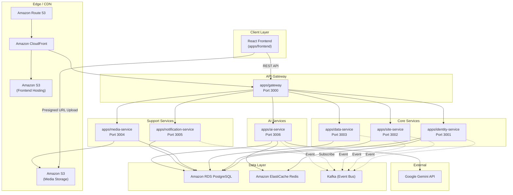

# Architecture Design

## Overview

Genzite is an AI-Powered No-Code Business Application Builder & Dynamic CMS. The system follows a **Microservices** architecture with 7 independent NestJS services organized in a monorepo.

## System Topology



## Repository Structure

```
genzite/
├── .ai/                             # AI agent rules & guardrails
├── apps/                            # All deployable applications
│   ├── gateway/                     # API Gateway (port 3000)
│   ├── identity-service/            # Auth, JWT, RBAC (port 3001)
│   ├── site-service/                # Sites, Pages, Widgets (port 3002)
│   ├── data-service/                # Dynamic CMS JSONB (port 3003)
│   ├── media-service/               # S3 Presigned URLs (port 3004)
│   ├── notification-service/        # Email, Push, In-App (port 3005)
│   ├── ai-service/                  # Google Gemini (port 3006)
│   └── frontend/                    # React + Vite + Tailwind CSS
├── packages/                        # Shared libraries
│   └── shared-types/                # DTOs, Events, Constants
├── infra/                           # Docker Compose orchestration
├── docs/                            # Product spec, DB design, API contracts
├── pnpm-workspace.yaml              # Root workspace: apps/* and packages/*
└── package.json                     # Root scripts and global dependencies
```

## Standard Service Structure

Each NestJS service under `apps/` follows this layout:

```
<service-name>/
├── src/
│   ├── <feature>/                   # Feature sub-modules
│   │   ├── dto/                     # Request validation (class-validator)
│   │   ├── <feature>.controller.ts
│   │   └── <feature>.service.ts
│   ├── entities/                    # Entity interfaces matching DB schema
│   ├── interfaces/                  # Cross-service exported abstractions
│   ├── events/                      # Kafka event producers
│   ├── app.module.ts
│   └── main.ts
├── Dockerfile.dev
├── nest-cli.json
├── package.json
└── tsconfig.json
```

## Global Language Rule
> **MANDATORY**: ALL source code, comments, documentation, and commit messages MUST be written strictly in **English**. Do not use Vietnamese or any other language in the codebase unless specifically required for localization files.

## Architecture Rules

### Service Independence
- Each service has its own **database schema** (PostgreSQL schema isolation).
- Services NEVER access each other's database directly.
- Cross-service communication: **Kafka events** (async) or **API Gateway** (sync proxy).

### LLM Isolation
The `ai-service` handles Google Gemini API calls (10–15 seconds per request). Long-running tasks are processed via BullMQ workers to avoid blocking.

### Media Upload Path
Media uploads **bypass all backend services**. The `media-service` generates **Presigned URLs** for S3. Frontend uploads directly, then notifies the backend via metadata callback.

### Data Layer Split
| Data Type | Storage Strategy |
|---|---|
| System config, Users, Roles, Site metadata | Standard PostgreSQL relational tables |
| User-generated CMS content, resumes, interviews | PostgreSQL `JSONB` columns |

> **RULE**: NEVER create fixed SQL columns for dynamic user data. All dynamic content MUST use JSONB.

## Design Philosophy

UI/UX aesthetic MUST be **cozy, user-friendly, and home-oriented**. Reject harsh, technical, or traditional IT-dashboard designs.
