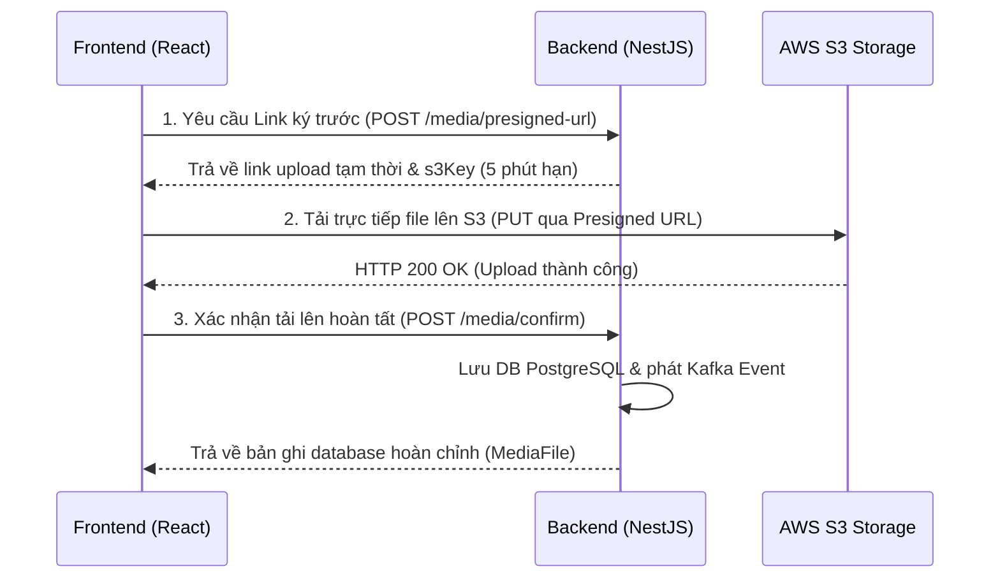

# BÀN GIAO THIẾT LẬP HẠ TẦNG AWS (COGNITO & S3)
> **Vai trò:** User C (Application & Storage)  
> **Người nhận:** User B (Backend) & User A (Security)

Tài liệu này dùng để bàn giao thông số hạ tầng AWS thực tế (môi trường Dev) và đặc tả kỹ thuật luồng tải lên Media trực tiếp lên S3 từ Frontend để User B (Backend) và User A (Security) triển khai phần việc tiếp theo.

---

## 1. THÔNG SỐ HẠ TẦNG THỰC TẾ (AWS Môi trường Dev)

Dưới đây là thông số tài nguyên AWS đã được khởi tạo và cấu hình thành công:

| Tài nguyên | Thông số / Giá trị thực tế | Mô tả |
| :--- | :--- | :--- |
| **AWS Region** | `us-east-1` | Vùng tài nguyên chính triển khai hệ thống |
| **S3 Media Bucket** | `genzite-media-dev-khoa-811046140260-us-east-1-an` | Dùng lưu trữ tệp tin (ảnh/video sản phẩm, avatar...) |
| **S3 Frontend Bucket** | `genzite-frontend-prod-khoa-811046140260-us-east-1-an` | Đã bật **Static Website Hosting** và thiết lập **Bucket Policy** cho phép truy cập đọc công khai (`public read`) |

---

## 2. ĐẶC TẢ API (API SPEC) CHO USER B (BACKEND NESTJS)

Để tối ưu hiệu năng và băng thông của server NestJS, Frontend đã được cấu hình chạy theo luồng tối ưu hóa truyền trực tiếp:


Yêu cầu User B hoàn thiện đúng 2 endpoint sau trong gói `apps/media-service` (đã khớp sẵn với hàm gọi API `uploadMediaFileApi` tại [media.ts](file:///d:/duanthuctap/Genzite/apps/frontend/src/api/media.ts) của Frontend):

### a) Endpoint 1: Lấy liên kết tải lên ký trước (Presigned URL)
*   **Path:** `POST /api/v1/media/presigned-url`
*   **Headers:**
    ```http
    Authorization: Bearer <jwt-token>
    x-user-id: <user-uuid>  # Được chèn tự động bởi API Gateway
    Content-Type: application/json
    ```
*   **Request Body:**
    ```json
    {
      "filename": "string",
      "mimeType": "string"
    }
    ```
*   **Response Body Mẫu (HTTP 201 Created):**
    ```json
    {
      "uploadUrl": "https://genzite-media-dev-khoa-811046140260-us-east-1-an.s3.amazonaws.com/uploads/user-uuid/filename.png?AWSAccessKeyId=...&Expires=...",
      "s3Key": "uploads/user-uuid/uuid-ngau-nhien/filename.png"
    }
    ```

### b) Endpoint 2: Xác nhận tải lên thành công (Confirm Upload)
*   **Path:** `POST /api/v1/media/confirm`
*   **Headers:**
    ```http
    Authorization: Bearer <jwt-token>
    x-user-id: <user-uuid>  # Được chèn tự động bởi API Gateway
    Content-Type: application/json
    ```
*   **Request Body:**
    ```json
    {
      "s3Key": "string",
      "filename": "string",
      "mimeType": "string",
      "sizeBytes": number
    }
    ```
*   **Response Body Mẫu (HTTP 201 Created):**
    *   Lưu thông tin metadata vào bảng `media_files` trong schema `media` của PostgreSQL, đồng thời trả về cấu trúc sau để Frontend kết xuất ảnh ngay lập tức:
    ```json
    {
      "id": "76ad06b3-e570-4e3a-96ad-1144f83d987e",
      "filename": "filename.png",
      "mimeType": "image/png",
      "sizeBytes": 1024,
      "createdAt": "2026-07-10T05:30:00.000Z",
      "url": "https://genzite-media-dev-khoa-811046140260-us-east-1-an.s3.us-east-1.amazonaws.com/uploads/user-uuid/uuid-ngau-nhien/filename.png"
    }
    ```

---

## 3. YÊU CẦU PHÂN QUYỀN CHO USER A (SECURITY)

Để Backend NestJS chạy trên EC2 hoặc container có thể ký được Presigned URL hợp lệ cho người dùng, đề nghị User A (Security) cấp quyền cho IAM Role đại diện của Backend (hoặc EC2 Instance Profile) theo tài liệu phân quyền sau:

### AWS IAM Inline Policy dành cho Media Service:
```json
{
    "Version": "2012-10-17",
    "Statement": [
        {
            "Sid": "AllowMediaServiceS3Access",
            "Effect": "Allow",
            "Action": [
                "s3:PutObject",
                "s3:GetObject"
            ],
            "Resource": "arn:aws:s3:::genzite-media-dev-khoa-811046140260-us-east-1-an/*"
        }
    ]
}
```

> [!IMPORTANT]
> Quyền hạn này chỉ giới hạn trên bucket media lưu trữ sản phẩm/avatar. Hãy đảm bảo **KHÔNG** cấp thêm quyền xóa tài nguyên hay quyền thao tác với các bucket nhạy cảm khác trên hệ thống.

---

## 4. BIẾN MÔI TRƯỜNG CỦA HỆ THỐNG (.env)

Vui lòng đồng bộ cấu hình này vào tệp `.env` của hệ thống chạy ở Production/Staging:

```env
# AWS S3 (Media Service)
AWS_S3_BUCKET=genzite-media-dev-khoa-811046140260-us-east-1-an
AWS_REGION=us-east-1

# AWS Cognito Configuration
AWS_COGNITO_USER_POOL_ID=us-east-1_JN6WuwuuM
AWS_COGNITO_CLIENT_ID=20gjbjlmo2pekj4jfj98js6ilk
AWS_COGNITO_REGION=us-east-1
```
