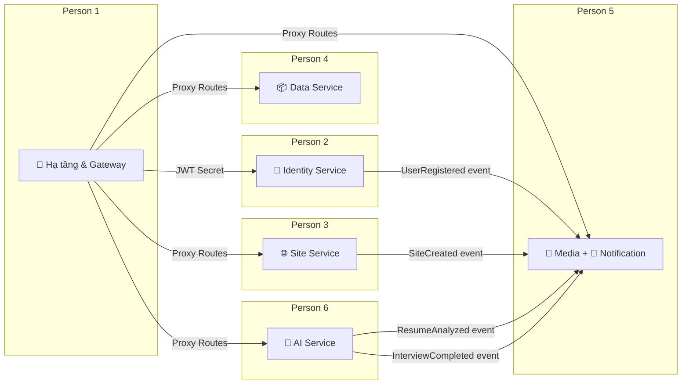
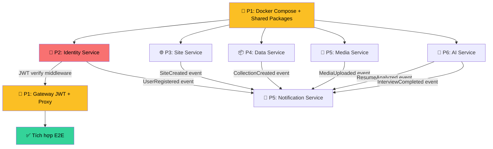

# Phân chia Task Backend & Database — Genzite (6 người)

> **Phạm vi:** Chỉ Backend (NestJS Microservices) + Database (Prisma/PostgreSQL). Không bao gồm Frontend.
> **Trạng thái hiện tại:** Tất cả services đã có cấu trúc thư mục placeholder, chưa có logic nghiệp vụ, chưa có Prisma schema, chưa tích hợp JWT/Kafka/Redis/Gemini.

---

## Tổng quan phân bổ

| Person | Service(s) | Port(s) | Database Schema(s) | Độ phức tạp |
|--------|-----------|---------|---------------------|-------------|
| **Person 1** | Gateway + Shared Packages + Infra | 3000 | — (không có DB riêng) | ⭐⭐⭐ |
| **Person 2** | Identity Service | 3001 | `identity_db` | ⭐⭐⭐ |
| **Person 3** | Site Service | 3002 | `site_db` | ⭐⭐⭐ |
| **Person 4** | Data Service (Dynamic CMS) | 3003 | `data_db` | ⭐⭐⭐⭐ |
| **Person 5** | Media Service + Notification Service | 3004, 3005 | `media_db`, `notification_db` | ⭐⭐⭐ |
| **Person 6** | AI Service | 3006 | `ai_db` | ⭐⭐⭐⭐⭐ |

---

## Sơ đồ phụ thuộc (Thứ tự triển khai)

> **Quy tắc:** Person 1 phải hoàn thành Docker Compose + Shared Packages **trước** để các Person khác bắt đầu code service. Sau đó tất cả chạy song song.

---

## Person 1: Hạ tầng, Shared Packages & API Gateway

> **Vai trò:** Tech Lead / DevOps — Người dựng nền móng cho toàn bộ hệ thống.
> **Phạm vi:** `infra/`, `packages/*`, `apps/gateway/`

### Phase A: Hạ tầng cơ sở (Blocker — Làm đầu tiên)

| # | Task | INPUT → OUTPUT → VERIFY |
|---|------|------------------------|
| 1.1 | **Cấu hình Docker Compose** cho môi trường dev | **IN:** Yêu cầu kiến trúc (PostgreSQL, Redis, Kafka) · **OUT:** `infra/docker-compose.yml` với containers: `postgres`, `redis`, `kafka`, `zookeeper` · **VERIFY:** `docker compose up -d` khởi chạy thành công, `psql` kết nối được |
| 1.2 | **Tạo 6 PostgreSQL schemas** độc lập | **IN:** Database design doc · **OUT:** Init script tạo schemas: `identity_db`, `site_db`, `data_db`, `media_db`, `notification_db`, `ai_db` · **VERIFY:** `\dn` trong psql liệt kê đủ 6 schemas |
| 1.3 | **Setup `packages/shared-types`** | **IN:** API contracts + Database design · **OUT:** Shared DTOs (`UserDto`, `SiteDto`, `MediaDto`...), Kafka event payload types (`user.events.ts`, `site.events.ts`, `ai.events.ts`), shared interfaces, constants (API routes, error codes, enums) · **VERIFY:** `npm run build` trong `shared-types` thành công, các service import được |
| 1.4 | **Setup `packages/shared-utils`** | **IN:** Cross-service utility needs · **OUT:** `jwt.util.ts` (JWT verify helper), `pagination.util.ts`, `validation.util.ts` · **VERIFY:** Unit test pass cho từng util |
| 1.5 | **Cấu hình `.env.example`** và NestJS ConfigModule pattern | **IN:** Danh sách env vars từ docs · **OUT:** `.env.example` đầy đủ (`DATABASE_URL`, `REDIS_HOST`, `REDIS_PORT`, `JWT_SECRET`, `GEMINI_API_KEY`, `AWS_S3_BUCKET`, `AWS_REGION`), pattern chuẩn cho `@nestjs/config` · **VERIFY:** Mỗi service load env thành công |

### Phase B: API Gateway

| # | Task | INPUT → OUTPUT → VERIFY |
|---|------|------------------------|
| 1.6 | **Gateway Proxy Controller** — Định tuyến request đến các service con | **IN:** Service ports mapping · **OUT:** `apps/gateway/src/proxy/proxy.controller.ts` route `/api/v1/auth/*` → `:3001`, `/api/v1/sites/*` → `:3002`, `/api/v1/cms/*` → `:3003`, `/api/v1/media/*` → `:3004`, `/api/v1/notifications/*` → `:3005`, `/api/v1/ai/*` → `:3006` · **VERIFY:** Request qua Gateway forward đúng service |
| 1.7 | **JWT Verification Middleware** trên Gateway | **IN:** JWT Secret từ Identity Service · **OUT:** `apps/gateway/src/auth/auth.middleware.ts` — decode JWT, gắn `x-user-id` + `x-user-roles` vào header trước khi proxy · **VERIFY:** Request không có token → `401`, request có token hợp lệ → forward với headers đúng |
| 1.8 | **Redis Rate Limiting Middleware** | **IN:** Redis connection · **OUT:** `apps/gateway/src/rate-limit/rate-limit.middleware.ts` — giới hạn request/phút theo IP · **VERIFY:** Gửi quá giới hạn → nhận `429 Too Many Requests` |
| 1.9 | **CORS + Helmet + Global Error Handler** | **IN:** Security requirements · **OUT:** Cấu hình CORS whitelist, Helmet headers, Global Exception Filter trả JSON chuẩn `{ statusCode, message, error }` · **VERIFY:** Response headers có security headers, lỗi trả đúng format |
| 1.10 | **Health Check endpoint** `/api/v1/health` | **IN:** — · **OUT:** Endpoint kiểm tra trạng thái kết nối tới PostgreSQL, Redis, Kafka · **VERIFY:** Tất cả services lên → `200 OK`, một service chết → response báo service nào down |

---

## Person 2: Identity Service (Auth & RBAC)

> **Vai trò:** Senior Backend — Xây dựng hệ thống xác thực và phân quyền.
> **Phạm vi:** `apps/identity-service/`
> **Database:** `identity_db` (tables: `users`, `roles`, `permissions`, `user_roles`, `role_permissions`)

### Phase A: Database & Prisma Schema

| # | Task | INPUT → OUTPUT → VERIFY |
|---|------|------------------------|
| 2.1 | **Prisma schema cho Identity** | **IN:** Database design doc · **OUT:** `prisma/schema.prisma` với models: `User`, `Role`, `Permission`, `UserRole`, `RolePermission` · **VERIFY:** `npx prisma migrate dev` chạy thành công, tables xuất hiện trong PostgreSQL |
| 2.2 | **Seed data cơ bản** | **IN:** Role/Permission matrix · **OUT:** `prisma/seed.ts` — tạo roles mặc định (`ADMIN`, `EDITOR`, `VIEWER`, `CANDIDATE`), permissions (`site:create`, `cms:write`, `media:upload`...), và 1 admin user · **VERIFY:** `npx prisma db seed` chạy xong, query thấy data |

### Phase B: Auth Module

| # | Task | INPUT → OUTPUT → VERIFY |
|---|------|------------------------|
| 2.3 | **POST `/api/v1/auth/register`** | **IN:** `{ email, password, name }` · **OUT:** Hash password (bcrypt), tạo User, gán role `VIEWER` mặc định, trả `{ id, email, name }` · **VERIFY:** Register 2 lần cùng email → `409 Conflict`; password trong DB là hash, không phải plaintext |
| 2.4 | **POST `/api/v1/auth/login`** | **IN:** `{ email, password }` · **OUT:** Verify password, sinh JWT chứa `{ sub: userId, roles: ['VIEWER'] }`, trả `{ accessToken, expiresIn: 86400 }` · **VERIFY:** Login sai password → `401`; token decode được và chứa đúng payload |
| 2.5 | **JWT Strategy + AuthGuard** | **IN:** `@nestjs/passport`, `@nestjs/jwt` · **OUT:** `JwtStrategy` validate token, `JwtAuthGuard` bảo vệ routes, decorator `@CurrentUser()` extract user từ request · **VERIFY:** Request không token → `401`; request token hết hạn → `401`; token hợp lệ → pass |
| 2.6 | **RBAC Guard + `@Roles()` decorator** | **IN:** Role/Permission model · **OUT:** `RolesGuard` kiểm tra user có role phù hợp, `@Roles('ADMIN')` decorator · **VERIFY:** User `VIEWER` gọi endpoint `@Roles('ADMIN')` → `403 Forbidden` |

### Phase C: Users Module

| # | Task | INPUT → OUTPUT → VERIFY |
|---|------|------------------------|
| 2.7 | **GET `/api/v1/users/me`** 🔒 | **IN:** JWT token · **OUT:** `{ id, email, name, roles: [...], avatarUrl }` · **VERIFY:** Trả đúng profile của user trong token |
| 2.8 | **PATCH `/api/v1/users/me`** 🔒 | **IN:** `{ name?, avatarUrl? }` · **OUT:** Cập nhật profile, trả user mới · **VERIFY:** Cập nhật name → GET lại thấy name mới |
| 2.9 | **GET `/api/v1/users`** 🔒 `@Roles('ADMIN')` | **IN:** Query params `?page=1&limit=20` · **OUT:** Danh sách users có phân trang · **VERIFY:** User không phải ADMIN → `403`; phân trang trả đúng count và data |
| 2.10 | **Kafka Producer — phát event** | **IN:** Kafka connection · **OUT:** Phát events `user.registered` (sau register), `user.updated` (sau update profile), `role.assigned` (sau gán role) · **VERIFY:** Kafka consumer test nhận được event với payload đúng format |

---

## Person 3: Site Service (Canvas Builder Backend)

> **Vai trò:** Backend Developer — API cho No-Code Canvas Builder.
> **Phạm vi:** `apps/site-service/`
> **Database:** `site_db` (tables: `sites`, `pages`, `widgets`)

### Phase A: Database & Prisma Schema

| # | Task | INPUT → OUTPUT → VERIFY |
|---|------|------------------------|
| 3.1 | **Prisma schema cho Site** | **IN:** Database design doc · **OUT:** `prisma/schema.prisma` với models: `Site` (có JSONB `settings`), `Page`, `Widget` (có JSONB `contentConfig`) · **VERIFY:** Migration chạy thành công |
| 3.2 | **Seed data mẫu** | **IN:** Widget types enum · **OUT:** 1 site mẫu + 2 pages + 5 widgets mẫu (HERO, CARD, TEXT, IMAGE, FOOTER) · **VERIFY:** Seed chạy, query thấy data với JSONB content đúng |

### Phase B: Sites CRUD

| # | Task | INPUT → OUTPUT → VERIFY |
|---|------|------------------------|
| 3.3 | **POST `/api/v1/sites`** 🔒 | **IN:** `{ name, subdomain }` + `x-user-id` header · **OUT:** Tạo site, gán `ownerId` từ header, trả `{ id, name, subdomain }` · **VERIFY:** Subdomain trùng → `409`; tạo thành công → query DB thấy record |
| 3.4 | **GET `/api/v1/sites`** 🔒 | **IN:** `x-user-id` header · **OUT:** Danh sách sites của user đó · **VERIFY:** User A không thấy sites của User B |
| 3.5 | **GET `/api/v1/sites/:siteId`** 🔒 | **IN:** siteId + owner check · **OUT:** Chi tiết site kèm `settings` JSONB · **VERIFY:** Truy cập site không thuộc sở hữu → `403` hoặc `404` |
| 3.6 | **PUT `/api/v1/sites/:siteId`** 🔒 | **IN:** `{ name?, subdomain?, settings? }` · **OUT:** Cập nhật site · **VERIFY:** Update settings JSONB → GET lại thấy settings mới |
| 3.7 | **DELETE `/api/v1/sites/:siteId`** 🔒 | **IN:** siteId · **OUT:** Xóa site + cascade xóa pages + widgets · **VERIFY:** Sau xóa, query pages/widgets của site đó → rỗng |

### Phase C: Pages CRUD

| # | Task | INPUT → OUTPUT → VERIFY |
|---|------|------------------------|
| 3.8 | **POST `/api/v1/sites/:siteId/pages`** 🔒 | **IN:** `{ title, slug }` · **OUT:** Tạo page, auto `sortOrder` · **VERIFY:** Slug trùng trong cùng site → `409` |
| 3.9 | **GET `/api/v1/sites/:siteId/pages`** 🔒 | **IN:** siteId · **OUT:** Danh sách pages sắp xếp theo `sortOrder` · **VERIFY:** Trả đúng thứ tự |
| 3.10 | **PUT `/api/v1/sites/pages/:pageId`** 🔒 | **IN:** `{ title?, slug?, sortOrder? }` · **OUT:** Cập nhật page · **VERIFY:** Thay đổi sortOrder → GET lại thứ tự thay đổi |
| 3.11 | **DELETE `/api/v1/sites/pages/:pageId`** 🔒 | **IN:** pageId · **OUT:** Xóa page + cascade widgets · **VERIFY:** Widgets thuộc page bị xóa sạch |

### Phase D: Widgets CRUD

| # | Task | INPUT → OUTPUT → VERIFY |
|---|------|------------------------|
| 3.12 | **PUT `/api/v1/sites/pages/:pageId/widgets`** 🔒 | **IN:** `{ widgets: [{ type, contentConfig, sortOrder }] }` · **OUT:** Replace toàn bộ widget stack của page (xóa cũ, tạo mới) · **VERIFY:** PUT 3 widgets → GET lại thấy đúng 3, đúng thứ tự, đúng JSONB content |
| 3.13 | **GET `/api/v1/sites/pages/:pageId/widgets`** 🔒 | **IN:** pageId · **OUT:** Danh sách widgets sắp xếp theo `sortOrder` · **VERIFY:** contentConfig JSONB trả đúng cấu trúc đã lưu |
| 3.14 | **Kafka Producer — phát event** | **IN:** Kafka connection · **OUT:** Events `site.created`, `page.updated`, `widget.config-changed` · **VERIFY:** Consumer test nhận event |

---

## Person 4: Data Service (Dynamic CMS — JSONB)

> **Vai trò:** Backend Developer — Hệ thống CMS động hoàn toàn bằng JSONB.
> **Phạm vi:** `apps/data-service/`
> **Database:** `data_db` (tables: `cms_collections`, `cms_records`)

> [!IMPORTANT]
> **Quy tắc vàng:** KHÔNG BAO GIỜ tạo cột SQL cố định cho dữ liệu người dùng. Toàn bộ dữ liệu động PHẢI lưu trong cột JSONB.

### Phase A: Database & Schema Validation Engine

| # | Task | INPUT → OUTPUT → VERIFY |
|---|------|------------------------|
| 4.1 | **Prisma schema cho Data** | **IN:** Database design doc · **OUT:** `prisma/schema.prisma` với models: `CmsCollection` (JSONB `schemaDefinition`), `CmsRecord` (JSONB `data`) · **VERIFY:** Migration thành công |
| 4.2 | **JSONB Schema Validator** (sử dụng `ajv`) | **IN:** Collection `schemaDefinition` + Record `data` · **OUT:** Module validate dữ liệu record khớp với schema definition trước khi lưu. Hỗ trợ types: `string`, `number`, `boolean`, `date`, `image`, `richtext` · **VERIFY:** Data không khớp schema → trả lỗi validation chi tiết; data khớp → pass |
| 4.3 | **JSONB GIN Index** cho cột `data` | **IN:** PostgreSQL config · **OUT:** Migration tạo GIN index trên `cms_records.data` để tăng tốc query JSONB · **VERIFY:** `EXPLAIN ANALYZE` query JSONB dùng index |

### Phase B: Collections CRUD

| # | Task | INPUT → OUTPUT → VERIFY |
|---|------|------------------------|
| 4.4 | **POST `/api/v1/cms/collections`** 🔒 | **IN:** `{ siteId, name, schemaDefinition: { properties: { fieldName: { type, required? } } } }` · **OUT:** Tạo collection · **VERIFY:** schemaDefinition JSONB lưu đúng; tạo collection trùng tên trong cùng site → `409` |
| 4.5 | **GET `/api/v1/cms/collections?siteId=`** 🔒 | **IN:** siteId · **OUT:** Danh sách collections của site · **VERIFY:** Chỉ trả collections thuộc site được chỉ định |
| 4.6 | **GET `/api/v1/cms/collections/:collectionId`** 🔒 | **IN:** collectionId · **OUT:** Chi tiết collection kèm schemaDefinition · **VERIFY:** ID không tồn tại → `404` |
| 4.7 | **PUT `/api/v1/cms/collections/:collectionId`** 🔒 | **IN:** `{ name?, schemaDefinition? }` · **OUT:** Cập nhật collection schema · **VERIFY:** Thay đổi schema → records cũ vẫn giữ nguyên (không bị mất data); records mới phải tuân theo schema mới |
| 4.8 | **DELETE `/api/v1/cms/collections/:collectionId`** 🔒 | **IN:** collectionId · **OUT:** Xóa collection + cascade xóa tất cả records · **VERIFY:** Records bị xóa sạch |

### Phase C: Records CRUD

| # | Task | INPUT → OUTPUT → VERIFY |
|---|------|------------------------|
| 4.9 | **POST `/api/v1/cms/collections/:collectionId/records`** 🔒 | **IN:** `{ data: { fieldName: value } }` · **OUT:** Validate `data` theo `schemaDefinition` của collection → Lưu vào JSONB → Trả record · **VERIFY:** Data thiếu required field → `400`; data type sai → `400`; data hợp lệ → lưu thành công |
| 4.10 | **GET `/api/v1/cms/collections/:collectionId/records`** 🔒 | **IN:** Query `?page=1&limit=20&sort=createdAt&order=desc` · **OUT:** Danh sách records có phân trang · **VERIFY:** Phân trang trả đúng `total`, `page`, `limit`, `data[]` |
| 4.11 | **GET `/api/v1/cms/records/:recordId`** 🔒 | **IN:** recordId · **OUT:** Chi tiết record · **VERIFY:** Record không tồn tại → `404` |
| 4.12 | **PUT `/api/v1/cms/records/:recordId`** 🔒 | **IN:** `{ data: { fieldName: newValue } }` · **OUT:** Validate → Cập nhật JSONB → Trả record mới · **VERIFY:** Cập nhật 1 field → các field khác không bị mất |
| 4.13 | **DELETE `/api/v1/cms/records/:recordId`** 🔒 | **IN:** recordId · **OUT:** Xóa record · **VERIFY:** GET sau xóa → `404` |
| 4.14 | **Kafka Producer — phát event** | **IN:** Kafka connection · **OUT:** Events `collection.created`, `record.created`, `record.updated` · **VERIFY:** Consumer test nhận event |
| 4.15 | **Tìm kiếm JSONB nâng cao** (Optional/Bonus) | **IN:** Query `?filter[name]=Rose&filter[price_gte]=10` · **OUT:** Filter records theo giá trị bên trong cột JSONB `data` · **VERIFY:** Filter trả đúng kết quả, performance chấp nhận được (<200ms cho 1000 records) |

---

## Person 5: Media Service + Notification Service

> **Vai trò:** Backend Developer — Quản lý file upload (S3) và hệ thống thông báo.
> **Phạm vi:** `apps/media-service/`, `apps/notification-service/`
> **Database:** `media_db` (table: `medias`), `notification_db` (tables: `notifications`, `notification_templates`)

> [!IMPORTANT]
> **Quy tắc Media:** Backend KHÔNG BAO GIỜ nhận file binary. Chỉ sinh Presigned URL và lưu metadata.

### Phase A: Media Service — Database & Presigned URL

| # | Task | INPUT → OUTPUT → VERIFY |
|---|------|------------------------|
| 5.1 | **Prisma schema cho Media** | **IN:** Database design doc · **OUT:** `prisma/schema.prisma` với model `Media` (`filename`, `s3Key`, `mimeType`, `sizeBytes`, `ownerId`) · **VERIFY:** Migration thành công |
| 5.2 | **POST `/api/v1/media/presigned-url`** 🔒 | **IN:** `{ filename, mimeType }` · **OUT:** Sinh S3 Presigned URL (AWS SDK `@aws-sdk/s3-request-presigner`), trả `{ uploadUrl, s3Key }`. S3 key format: `uploads/<userId>/<uuid>/<filename>` · **VERIFY:** `uploadUrl` là URL S3 hợp lệ; PUT file lên URL đó thành công |
| 5.3 | **POST `/api/v1/media/confirm`** 🔒 | **IN:** `{ s3Key, filename, mimeType, sizeBytes }` · **OUT:** Tạo record `Media` trong DB, phát event `media.uploaded` · **VERIFY:** Record tồn tại trong DB; confirm cùng s3Key 2 lần → `409` |
| 5.4 | **GET `/api/v1/media`** 🔒 | **IN:** `x-user-id` + query `?page=1&limit=20` · **OUT:** Danh sách media files của user có phân trang · **VERIFY:** User A không thấy media của User B |
| 5.5 | **DELETE `/api/v1/media/:mediaId`** 🔒 | **IN:** mediaId · **OUT:** Xóa record DB + gọi S3 DeleteObject xóa file thực · **VERIFY:** Sau xóa, GET trả `404`; S3 object không còn |
| 5.6 | **Kafka Producer — phát event** `media.uploaded`, `media.deleted` | **IN:** Kafka connection · **OUT:** Events với payload `{ mediaId, s3Key, ownerId }` · **VERIFY:** Consumer nhận event |

### Phase B: Notification Service — Database & Kafka Consumer

| # | Task | INPUT → OUTPUT → VERIFY |
|---|------|------------------------|
| 5.7 | **Prisma schema cho Notification** | **IN:** Notification requirements · **OUT:** Models: `Notification` (`userId`, `type`, `title`, `body`, `isRead`, `metadata` JSONB), `NotificationTemplate` (`slug`, `subject`, `bodyTemplate`) · **VERIFY:** Migration thành công |
| 5.8 | **Kafka Consumer — `user.registered`** | **IN:** Event từ Identity Service · **OUT:** Tạo notification "Chào mừng bạn đến với Genzite!" + gửi Welcome Email (mock/nodemailer) · **VERIFY:** Register user mới → Notification xuất hiện trong DB + email log |
| 5.9 | **Kafka Consumer — `resume.analyzed`** | **IN:** Event từ AI Service · **OUT:** Tạo notification "Kết quả phân tích CV đã sẵn sàng" · **VERIFY:** Event vào → notification record tạo đúng userId và metadata |
| 5.10 | **Kafka Consumer — `interview.completed`** | **IN:** Event từ AI Service · **OUT:** Tạo notification "Báo cáo phỏng vấn thử đã hoàn thành" · **VERIFY:** Event vào → notification tạo thành công |
| 5.11 | **Kafka Consumer — `site.created`** | **IN:** Event từ Site Service · **OUT:** Tạo notification "Website [name] đã được tạo thành công!" · **VERIFY:** Event vào → notification tạo đúng |
| 5.12 | **GET `/api/v1/notifications`** 🔒 | **IN:** `x-user-id` + query `?page=1&limit=20&unreadOnly=true` · **OUT:** Danh sách notifications của user, sắp xếp mới nhất trước · **VERIFY:** Chỉ trả notifications của đúng user; filter unread hoạt động |
| 5.13 | **PUT `/api/v1/notifications/:id/read`** 🔒 | **IN:** notification id · **OUT:** Đánh dấu `isRead = true` · **VERIFY:** GET lại → `isRead` = true |
| 5.14 | **PUT `/api/v1/notifications/read-all`** 🔒 | **IN:** `x-user-id` · **OUT:** Đánh dấu tất cả notifications của user là đã đọc · **VERIFY:** GET `?unreadOnly=true` → trả rỗng |

---

## Person 6: AI Service (Google Gemini + BullMQ)

> **Vai trò:** Backend Developer (AI Specialist) — Tích hợp Google Gemini và xây dựng AI Recruitment Suite.
> **Phạm vi:** `apps/ai-service/`
> **Database:** `ai_db` (tables: `resumes`, `interview_sessions`)

> [!IMPORTANT]
> **Quy tắc AI Isolation:** Tất cả call Gemini API PHẢI đi qua BullMQ worker. Không gọi trực tiếp trong controller. Response time có thể 10-15 giây.

### Phase A: Database & Hạ tầng BullMQ

| # | Task | INPUT → OUTPUT → VERIFY |
|---|------|------------------------|
| 6.1 | **Prisma schema cho AI** | **IN:** Database design doc · **OUT:** Models: `Resume` (JSONB `parsedProfile`, JSONB `atsScores`), `InterviewSession` (JSONB `dialogueHistory`, JSONB `evaluation`, `status` enum) · **VERIFY:** Migration thành công, JSONB columns đúng |
| 6.2 | **BullMQ Setup** | **IN:** Redis connection · **OUT:** Queue `ai-tasks` + Worker processor + Job types enum (`GENERATE_SITE`, `GENERATE_CMS`, `ANALYZE_CV`, `GENERATE_QUESTIONS`) · **VERIFY:** Thêm job vào queue → worker nhận và xử lý → job status chuyển `completed` |
| 6.3 | **Gemini Client Wrapper** | **IN:** `@google/generative-ai` SDK · **OUT:** `GeminiService` singleton wrap SDK, retry logic (3 lần, exponential backoff), rate limiting, structured output parsing · **VERIFY:** Gọi Gemini trả kết quả; timeout → retry; 3 lần fail → throw error rõ ràng |

### Phase B: AI Agents & Pipelines (MCP Integrated)

| # | Task | INPUT → OUTPUT → VERIFY |
|---|------|------------------------|
| 6.4 | **POST `/api/v1/ai/agent/chat`** 🔒 | **IN:** `{ message }` · **OUT:** Tạo BullMQ job `AGENT_TASKS` → Gemini phân tích và gọi Function Calling (e.g., Build Site, Gen CMS) → Trả `{ jobId, status: 'processing' }` (202 Accepted) · **VERIFY:** Job xử lý ngầm, kết quả lưu vào `AiTaskLog` |
| 6.5 | **POST `/api/v1/ai/agent/plan`** 🔒 | **IN:** `{ goal }` · **OUT:** Tạo BullMQ job `AGENT_TASKS` → Gemini lên kế hoạch multi-step và thực thi dần → Trả `{ jobId }` · **VERIFY:** Các step chạy tuần tự, nếu lỗi tự động retry hoặc re-plan |
| 6.6 | **POST `/api/v1/ai/agent/ui`** 🔒 | **IN:** `{ prompt }` · **OUT:** Tạo BullMQ job → Gemini UI Agent sinh React/TSX components chuẩn UX/UI → Trả `{ jobId }` · **VERIFY:** Component sinh ra có Tailwind CSS, 8pt grid, 60-30-10 colors |

### Phase C: AI Resume & CV Analysis

| # | Task | INPUT → OUTPUT → VERIFY |
|---|------|------------------------|
| 6.7 | **POST `/api/v1/ai/resumes`** 🔒 | **IN:** `{ title, rawText, s3Key? }` · **OUT:** Tạo record Resume, queue BullMQ job parse profile · **VERIFY:** Resume record tạo trong DB; `parsedProfile` ban đầu null |
| 6.8 | **BullMQ Worker: Parse Resume Profile** | **IN:** Resume `rawText` · **OUT:** Gemini parse → Cập nhật `parsedProfile` JSONB: `{ contact, experience: [], skills: [], education: [] }` · **VERIFY:** Sau worker chạy, `parsedProfile` không null và có cấu trúc đúng |
| 6.9 | **POST `/api/v1/ai/analyze-cv`** 🔒 | **IN:** `{ resumeId, jobDescription }` · **OUT:** Gemini so sánh CV vs JD → Cập nhật `atsScores` JSONB → Trả `{ atsScore, missingSkills, keywordOptimization, compatibilityReport }` · **VERIFY:** ATS score trong khoảng 0-100; missingSkills là array strings; phát event `resume.analyzed` qua Kafka |
| 6.10 | **GET `/api/v1/ai/resumes`** 🔒 | **IN:** `x-user-id` · **OUT:** Danh sách resumes của user · **VERIFY:** Chỉ trả resumes của đúng user |
| 6.11 | **GET `/api/v1/ai/resumes/:resumeId`** 🔒 | **IN:** resumeId · **OUT:** Chi tiết resume kèm `parsedProfile` và `atsScores` · **VERIFY:** Resume không thuộc user → `403` |

### Phase D: AI Mock Interview

| # | Task | INPUT → OUTPUT → VERIFY |
|---|------|------------------------|
| 6.12 | **POST `/api/v1/ai/mock-interview/start`** 🔒 | **IN:** `{ resumeId, jobDescription, sessionType: 'TECHNICAL' | 'BEHAVIORAL' | 'MIXED' }` · **OUT:** Tạo `InterviewSession` record, Gemini sinh câu hỏi đầu tiên dựa trên CV + JD, trả `{ sessionId, firstQuestion }` · **VERIFY:** Session record tạo trong DB với status `IN_PROGRESS`; `dialogueHistory` JSONB = `[{ role: 'interviewer', content: firstQuestion, timestamp }]` |
| 6.13 | **POST `/api/v1/ai/mock-interview/:sessionId/chat`** 🔒 | **IN:** `{ message }` (câu trả lời của ứng viên) · **OUT:** Append vào `dialogueHistory`, Gemini đánh giá + sinh câu hỏi tiếp → Trả `{ feedback, score, nextQuestion, isComplete }` · **VERIFY:** `dialogueHistory` tăng thêm 2 entries (candidate answer + interviewer question); score là number 1-10 |
| 6.14 | **POST `/api/v1/ai/mock-interview/:sessionId/end`** 🔒 | **IN:** sessionId · **OUT:** Gemini tổng hợp toàn bộ dialogue → Cập nhật `evaluation` JSONB `{ overallScore, strengths, weaknesses, studyRecommendations }`, status → `COMPLETED`, phát event `interview.completed` · **VERIFY:** `evaluation` JSONB đầy đủ; status = `COMPLETED`; Kafka event gửi thành công |

### Phase E: AI Career Coaching

| # | Task | INPUT → OUTPUT → VERIFY |
|---|------|------------------------|
| 6.15 | **GET `/api/v1/ai/career-coaching/:resumeId`** 🔒 | **IN:** resumeId · **OUT:** Gemini phân tích parsedProfile + atsScores + interview evaluations → Sinh `{ roadmap: [{ phase, topic, priority, resources }] }` · **VERIFY:** Roadmap có ít nhất 3 phases; priority là `HIGH` / `MEDIUM` / `LOW` |

---

## Bảng tổng hợp Tasks theo Person

| Person | Tasks | APIs | Kafka Events (Produce) | Kafka Events (Consume) |
|--------|-------|------|------------------------|------------------------|
| **P1** | 10 | 1 (`/health`) | — | — |
| **P2** | 10 | 5 | `user.registered`, `user.updated`, `role.assigned` | — |
| **P3** | 14 | 9 | `site.created`, `page.updated`, `widget.config-changed` | — |
| **P4** | 15 | 9 | `collection.created`, `record.created`, `record.updated` | — |
| **P5** | 14 | 5 (Media) + 3 (Notif) | `media.uploaded`, `media.deleted` | `user.registered`, `resume.analyzed`, `interview.completed`, `site.created` |
| **P6** | 15 | 10 | `resume.analyzed`, `interview.completed` | — |
| **Tổng** | **78 tasks** | **42 endpoints** | **12 event types** | **4 consumers** |

---

## Quy ước chung bắt buộc (Tất cả 6 người)

### API Standards
- Tất cả routes prefix `/api/v1` (set global `app.setGlobalPrefix('api/v1')`)
- ValidationPipe global: `new ValidationPipe({ whitelist: true, transform: true })`
- Response format lỗi chuẩn: `{ statusCode, message, error }`
- DTOs dùng `class-validator` decorators, KHÔNG dùng `any`

### Database Rules
- Mỗi service sở hữu database schema riêng, KHÔNG truy cập chéo DB
- Dữ liệu động → JSONB. KHÔNG tạo cột SQL cố định cho user data
- Prisma client KHÔNG được expose ra ngoài service layer

### Cross-Service Communication
- Đồng bộ: Qua Gateway proxy (HTTP)
- Bất đồng bộ: Qua Kafka events
- Gateway gắn `x-user-id` và `x-user-roles` vào header sau khi verify JWT

### Shared Packages (do P1 maintain)
- `@genzite/shared-types`: DTOs, event types, interfaces, constants
- `@genzite/shared-utils`: JWT verify, pagination, validation helpers
