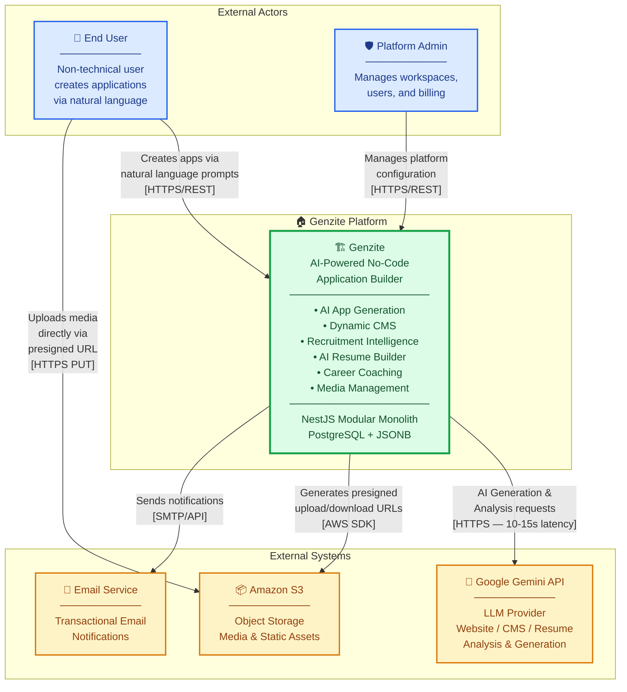
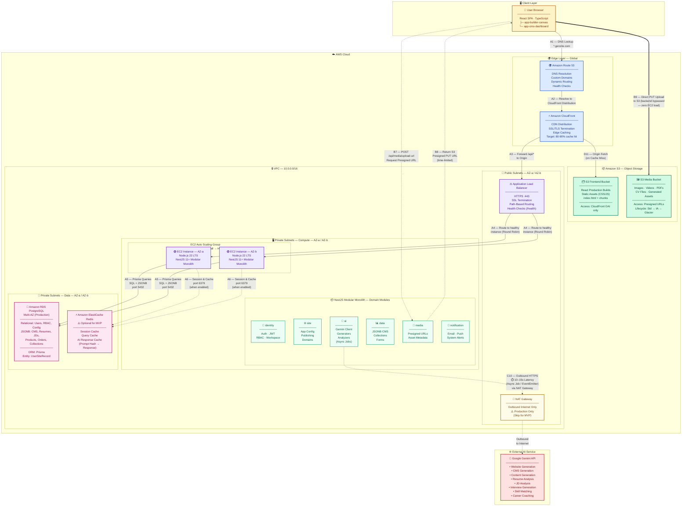
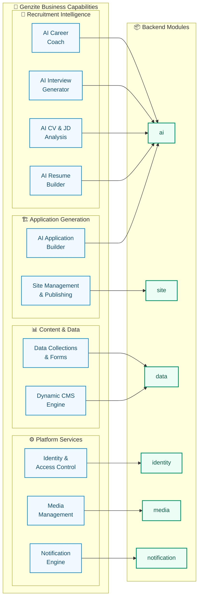
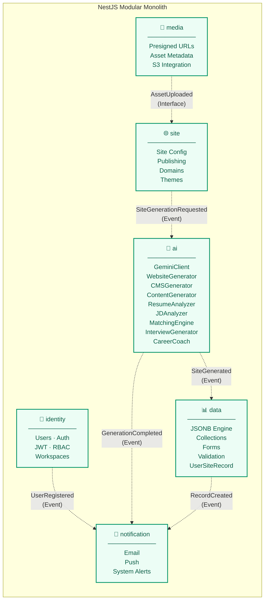
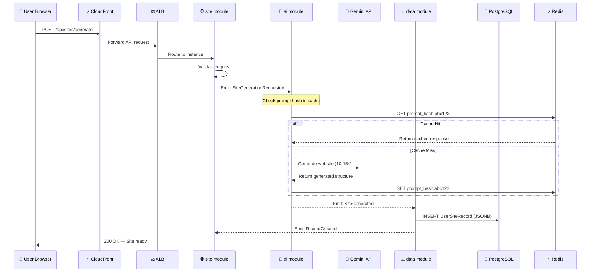
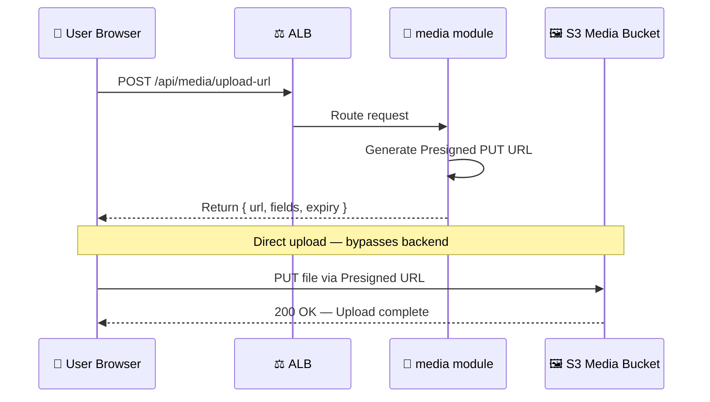
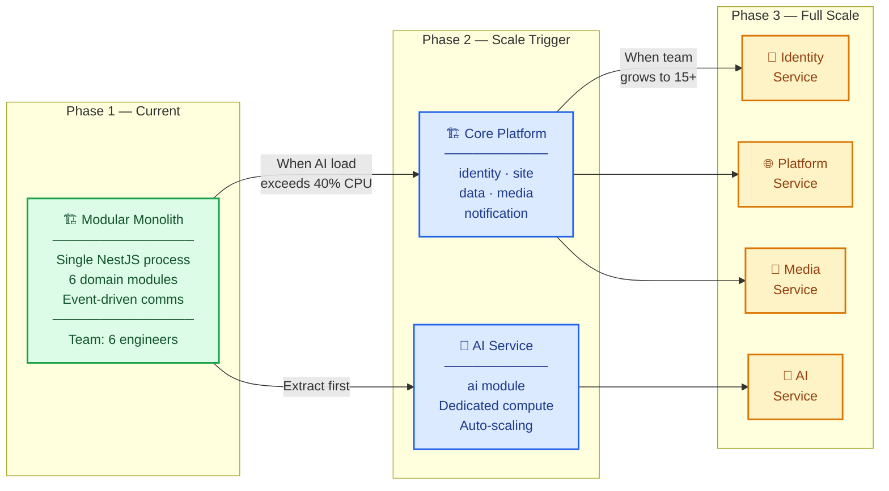

# Genzite — AWS Solution Architecture & C4 Hybrid Diagram

> **Document Classification:** Technical Architecture — Presentation Grade
>
> **Audience:** CTO Review · Enterprise Architecture Board · Technical Defense · Investor Demo · Capstone Presentation
>
> **Stack:** NestJS 11+ · TypeScript · Node.js 22 LTS · Prisma · PostgreSQL · Redis · AWS · Google Gemini

---

## 1. C4 Level 1 — System Context Diagram



---

## 2. AWS Production Infrastructure Diagram



---

## 3. Business Capability Map



---

## 4. Module Decomposition — Event-Driven Communication



> **Architectural Invariant:** Cross-domain `@Inject()` is strictly forbidden. All inter-module communication flows through `EventEmitter2` application events or shared domain interfaces. This preserves module boundaries and enables future service extraction.

---

## 5. Data Flow Sequences

### Flow A+C — AI Application Generation (End-to-End)



### Flow B — Direct Media Upload



---

## 6. Network & Security Architecture

```
┌──────────────────────────────────────────────────────────────────┐
│                       AWS Cloud — Region                         │
│                                                                  │
│   🌍 Route 53 ──→ ⚡ CloudFront ──→ 📦 S3 (Frontend Bucket)     │
│                          │                                       │
│   ┌──────────────────────┼──── VPC 10.0.0.0/16 ────────────────┐│
│   │                      │                                     ││
│   │  ┌─── Public Subnets (10.0.1.0/24 · 10.0.2.0/24) ────┐   ││
│   │  │                                                     │   ││
│   │  │  ⚖️  ALB (HTTPS :443)    🔁 NAT GW (Prod only)     │   ││
│   │  │                                                     │   ││
│   │  └───────────────┬───────────────────┬─────────────────┘   ││
│   │                  │                   │                     ││
│   │  ┌─── Private Subnets — Compute (10.0.10.0/24) ───────┐   ││
│   │  │                                                     │   ││
│   │  │  🟢 EC2 ASG (NestJS Modular Monolith)               │   ││
│   │  │     ├─ identity  ├─ site   ├─ ai                    │   ││
│   │  │     ├─ data      ├─ media  └─ notification          │   ││
│   │  │                                                     │   ││
│   │  │  SG Inbound:  TCP 8080 from ALB SG only            │   ││
│   │  │  SG Outbound: TCP 443 → NAT GW (Gemini API)        │   ││
│   │  │               TCP 5432 → RDS SG                     │   ││
│   │  │               TCP 6379 → Redis SG                   │   ││
│   │  └───────────────┬───────────────────┬─────────────────┘   ││
│   │                  │                   │                     ││
│   │  ┌─── Private Subnets — Data (10.0.20.0/24) ──────────┐   ││
│   │  │                                                     │   ││
│   │  │  🐘 RDS PostgreSQL         ⚡ ElastiCache Redis     │   ││
│   │  │     Multi-AZ (Prod)           (Optional MVP)        │   ││
│   │  │     SG: 5432 from EC2         SG: 6379 from EC2    │   ││
│   │  │                                                     │   ││
│   │  └─────────────────────────────────────────────────────┘   ││
│   │                                                            ││
│   └────────────────────────────────────────────────────────────┘│
│                                                                  │
│   📦 S3 Media Bucket (Presigned URL access only)                 │
│                                                                  │
└──────────────────────────────────────────────────────────────────┘
          │
          │  Outbound HTTPS (via NAT GW)
          ▼
   🤖 Google Gemini API
```

### Security Group Rules

| Rule | Source | Destination | Port | Protocol | Notes |
|------|--------|-------------|------|----------|-------|
| ALB Ingress | `0.0.0.0/0` | ALB SG | 443 | HTTPS | Public internet |
| EC2 Ingress | ALB SG | EC2 SG | 8080 | HTTP | Internal only |
| RDS Ingress | EC2 SG | RDS SG | 5432 | TCP | Prisma connections |
| Redis Ingress | EC2 SG | Redis SG | 6379 | TCP | Cache R/W |
| AI Egress | EC2 SG | NAT GW | 443 | HTTPS | Gemini API calls |

### S3 Bucket Policies

| Bucket | Access Model | Notes |
|--------|-------------|-------|
| Frontend | CloudFront OAI | No public access; served only via CDN |
| Media | Presigned PUT/GET | Time-limited; per-object; no direct public access |

---

## 7. Data Flow Reference Table

| Flow | Step | Arrow | Path | Description |
|------|------|-------|------|-------------|
| **A** | 1 | `──▶` | Browser → Route 53 | DNS lookup `*.genzite.com` |
| **A** | 2 | `──▶` | Route 53 → CloudFront | Resolves to distribution endpoint |
| **A** | 3 | `──▶` | CloudFront → ALB | `/api/*` forwarded to origin |
| **A** | 4 | `──▶` | ALB → EC2 ASG | Round-robin to healthy NestJS instance |
| **A** | 5 | `◀─▶` | EC2 ↔ RDS PostgreSQL | Prisma queries: SQL + JSONB (port 5432) |
| **A** | 6 | `◀╌▶` | EC2 ↔ ElastiCache Redis | Session, query, AI cache (port 6379, optional MVP) |
| **B** | 7 | `╌─▶` | Browser → `media` module | `POST /api/media/upload-url` |
| **B** | 8 | `◀╌─` | `media` module → Browser | Returns presigned S3 PUT URL |
| **B** | 9 | `══▶` | Browser → S3 Media Bucket | **Direct upload — backend fully bypassed** |
| **C** | 10 | `╌─▶` | `ai` module → Gemini API | Async outbound via NAT GW (**⏱️ 10–15s latency**) |
| **D** | 11 | `──▶` | CloudFront → S3 Frontend | Origin fetch on cache miss (React SPA) |

---

## 8. Cost Optimization — MVP vs Production

| Component | MVP Mode | Production Mode |
|-----------|----------|-----------------|
| **Compute** | Single `t4g.small` (~$12/mo) | ASG `t4g.medium`–`t4g.large` Graviton |
| **Load Balancer** | ❌ Optional — direct EC2 | ✅ ALB with health checks |
| **NAT Gateway** | ❌ Skip — public subnet egress | ✅ Private subnet isolation |
| **RDS PostgreSQL** | Single-AZ `db.t4g.micro` (~$13/mo) | Multi-AZ `db.t4g.small`+ |
| **Redis** | ❌ Skip — app works without it | ✅ ElastiCache for session/AI cache |
| **CloudFront** | ✅ Free tier + minimal traffic | ✅ Full CDN distribution |
| **S3** | ✅ Standard tier only | ✅ Lifecycle: Standard → IA → Glacier |
| **AI Caching** | In-memory Map (basic) | Redis prompt-hash cache |
| **Estimated Cost** | **~$35–60/month** | **~$150–350/month** |

> **MVP is suitable for:** Development, Demo, Capstone Project, Early Launch
>
> **Production is suitable for:** Real Customers, High Availability, Traffic Growth

---

## 9. Platform Evolution Roadmap



> **Do NOT prematurely split into microservices.** The modular monolith supports the current 6-person team efficiently. Extract services only when measurable bottlenecks emerge (AI CPU saturation, team coordination overhead, or independent scaling requirements).
