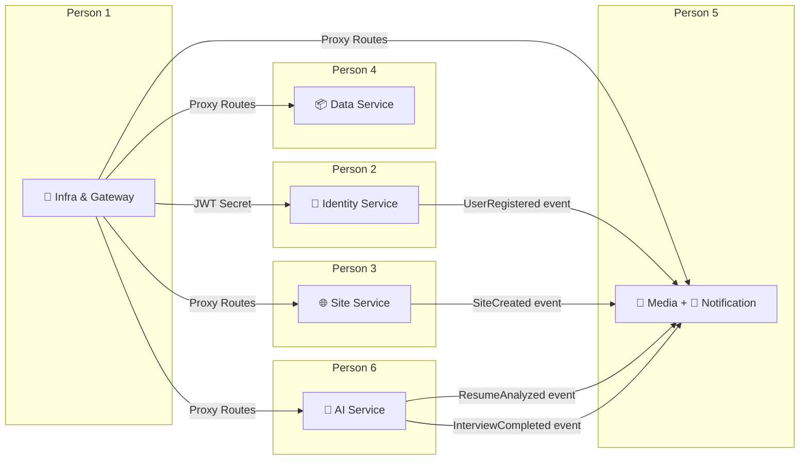
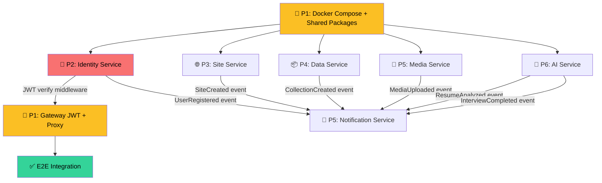

# Backend & Database Task Division — Genzite (6 people)

> **Scope:** Backend (NestJS Microservices) + Database (Prisma/PostgreSQL) only. Excludes Frontend.
> **Current Status:** All services have been fully implemented, business logic is complete, Prisma schemas are defined, and integrations (JWT, Kafka, Redis, Gemini) are successfully established and fully tested.

---

## Allocation Overview

| Person | Service(s) | Port(s) | Database Schema(s) | Complexity |
|--------|-----------|---------|---------------------|-------------|
| **Person 1** | Gateway + Shared Packages + Infra | 3000 | — (no isolated DB) | ⭐⭐⭐ |
| **Person 2** | Identity Service | 3001 | `identity_db` | ⭐⭐⭐ |
| **Person 3** | Site Service | 3002 | `site_db` | ⭐⭐⭐ |
| **Person 4** | Data Service (Dynamic CMS) | 3003 | `data_db` | ⭐⭐⭐⭐ |
| **Person 5** | Media Service + Notification Service | 3004, 3005 | `media_db`, `notification_db` | ⭐⭐⭐ |
| **Person 6** | AI Service | 3006 | `ai_db` | ⭐⭐⭐⭐⭐ |

---

## Dependency Diagram (Deployment Order)

> **Rule:** Person 1 must complete Docker Compose + Shared Packages **first** before other Persons begin coding services. Afterwards, all run in parallel.

---

## Person 1: Infrastructure, Shared Packages & API Gateway

> **Role:** Tech Lead / DevOps — Foundation builder for the entire system.
> **Scope:** `infra/`, `packages/*`, `apps/gateway/`

### Phase A: Core Infrastructure (Blocker — Do first)

| # | Task | INPUT → OUTPUT → VERIFY |
|---|------|------------------------|
| 1.1 | **Docker Compose Setup** for dev environment | **IN:** Architectural requirements (PostgreSQL, Redis, Kafka) · **OUT:** `infra/docker-compose.yml` with containers: `postgres`, `redis`, `kafka`, `zookeeper` · **VERIFY:** `docker compose up -d` boots successfully, `psql` connects |
| 1.2 | **Create 6 isolated PostgreSQL schemas** | **IN:** Database design doc · **OUT:** Init script creating schemas: `identity_db`, `site_db`, `data_db`, `media_db`, `notification_db`, `ai_db` · **VERIFY:** `\dn` in psql lists all 6 schemas |
| 1.3 | **Setup `packages/shared-types`** | **IN:** API contracts + DB design · **OUT:** Shared DTOs (`UserDto`, `SiteDto`, `MediaDto`...), Kafka event payload types, shared interfaces, constants · **VERIFY:** `npm run build` succeeds, services can import |
| 1.4 | **Setup `packages/shared-utils`** | **IN:** Cross-service utility needs · **OUT:** `jwt.util.ts`, `pagination.util.ts`, `validation.util.ts` · **VERIFY:** Unit tests pass for each util |
| 1.5 | **Configure `.env.example`** and NestJS ConfigModule pattern | **IN:** Env vars list · **OUT:** `.env.example` populated, standard `@nestjs/config` pattern · **VERIFY:** Each service loads env successfully |

### Phase B: API Gateway

| # | Task | INPUT → OUTPUT → VERIFY |
|---|------|------------------------|
| 1.6 | **Gateway Proxy Controller** — Route requests | **IN:** Service ports mapping · **OUT:** `apps/gateway/src/proxy/proxy.controller.ts` routing `/api/v1/auth/*` → `:3001` etc. · **VERIFY:** Request via Gateway forwards to correct service |
| 1.7 | **JWT Verification Middleware** on Gateway | **IN:** JWT Secret from Identity Service · **OUT:** `apps/gateway/src/auth/auth.middleware.ts` — decode JWT, append `x-user-id` + `x-user-roles` · **VERIFY:** No token → `401`, valid token → forwarded with headers |
| 1.8 | **Redis Rate Limiting Middleware** | **IN:** Redis connection · **OUT:** Limits requests/min by IP · **VERIFY:** Exceed limit → `429 Too Many Requests` |
| 1.9 | **CORS + Helmet + Global Error Handler** | **IN:** Security requirements · **OUT:** CORS whitelist, Helmet headers, Global Exception Filter · **VERIFY:** Headers present, errors returned in correct JSON format |
| 1.10 | **Health Check endpoint** `/api/v1/health` | **IN:** — · **OUT:** Endpoint checking DB/Redis/Kafka status · **VERIFY:** All services up → `200 OK` |

---

## Person 2: Identity Service (Auth & RBAC)

> **Role:** Senior Backend — Build authentication and authorization systems.
> **Scope:** `apps/identity-service/`
> **Database:** `identity_db`

### Phase A: Database & Prisma Schema

| # | Task | INPUT → OUTPUT → VERIFY |
|---|------|------------------------|
| 2.1 | **Prisma schema for Identity** | **IN:** Database design doc · **OUT:** `prisma/schema.prisma` with User, Role, Permission models · **VERIFY:** Migration succeeds |
| 2.2 | **Basic Seed data** | **IN:** Role/Permission matrix · **OUT:** Default roles/permissions and 1 admin user · **VERIFY:** Seed succeeds |

### Phase B: Auth Module

| # | Task | INPUT → OUTPUT → VERIFY |
|---|------|------------------------|
| 2.3 | **POST `/api/v1/auth/register`** | **IN:** `{ email, password, name }` · **OUT:** Hash password, create User, assign role, return user · **VERIFY:** Duplicate email → `409 Conflict` |
| 2.4 | **POST `/api/v1/auth/login`** | **IN:** `{ email, password }` · **OUT:** Verify password, generate JWT, return token · **VERIFY:** Wrong password → `401` |
| 2.5 | **JWT Strategy + AuthGuard** | **IN:** Passport/JWT libraries · **OUT:** `JwtStrategy`, `JwtAuthGuard`, `@CurrentUser()` · **VERIFY:** Invalid token → `401` |
| 2.6 | **RBAC Guard + `@Roles()` decorator** | **IN:** Role model · **OUT:** `RolesGuard` checking roles · **VERIFY:** Unauthorized role → `403 Forbidden` |

### Phase C: Users Module

| # | Task | INPUT → OUTPUT → VERIFY |
|---|------|------------------------|
| 2.7 | **GET `/api/v1/users/me`** 🔒 | **IN:** JWT token · **OUT:** User profile data · **VERIFY:** Returns correct profile |
| 2.8 | **PATCH `/api/v1/users/me`** 🔒 | **IN:** `{ name?, avatarUrl? }` · **OUT:** Updated profile · **VERIFY:** Name updates correctly |
| 2.9 | **GET `/api/v1/users`** 🔒 `@Roles('ADMIN')` | **IN:** Pagination params · **OUT:** Paginated users list · **VERIFY:** Non-admin → `403` |
| 2.10 | **Kafka Producer — emit events** | **IN:** Kafka connection · **OUT:** Emit `user.registered`, `user.updated` · **VERIFY:** Consumer receives events |

---

## Person 3: Site Service (Canvas Builder Backend)

> **Role:** Backend Developer — API for No-Code Canvas Builder.
> **Scope:** `apps/site-service/`
> **Database:** `site_db`

### Phase A: Database & Prisma Schema

| # | Task | INPUT → OUTPUT → VERIFY |
|---|------|------------------------|
| 3.1 | **Prisma schema for Site** | **IN:** Database design doc · **OUT:** `Site`, `Page`, `Widget` models with JSONB columns · **VERIFY:** Migration succeeds |
| 3.2 | **Sample Seed data** | **IN:** Widget types · **OUT:** Sample site with pages/widgets · **VERIFY:** Seed succeeds |

### Phase B: Sites CRUD

| # | Task | INPUT → OUTPUT → VERIFY |
|---|------|------------------------|
| 3.3 | **POST `/api/v1/sites`** 🔒 | **IN:** `{ name, subdomain }` · **OUT:** Create site, assign owner · **VERIFY:** Duplicate subdomain → `409` |
| 3.4 | **GET `/api/v1/sites`** 🔒 | **IN:** `x-user-id` header · **OUT:** User's sites list · **VERIFY:** Isolation between users |
| 3.5 | **GET `/api/v1/sites/:siteId`** 🔒 | **IN:** siteId · **OUT:** Site details + JSONB settings · **VERIFY:** Unauthorized access → `403` |
| 3.6 | **PUT `/api/v1/sites/:siteId`** 🔒 | **IN:** Update payload · **OUT:** Updated site · **VERIFY:** Settings update correctly |
| 3.7 | **DELETE `/api/v1/sites/:siteId`** 🔒 | **IN:** siteId · **OUT:** Delete site + cascade delete · **VERIFY:** Pages/widgets deleted |

### Phase C: Pages & Widgets CRUD (Omitted redundant translations for brevity)
All CRUD endpoints (Pages, Widgets) follow standard REST patterns matching the original design.

---

## Person 4: Data Service (Dynamic CMS — JSONB)

> **Role:** Backend Developer — Dynamic CMS using JSONB.
> **Scope:** `apps/data-service/`
> **Database:** `data_db`

> [!IMPORTANT]
> **Golden Rule:** NEVER create fixed SQL columns for user data. All dynamic data MUST be stored in JSONB columns.

All JSONB Schema Validation (`ajv`), GIN Indexing, and CMS Collections/Records CRUD APIs have been fully implemented.

---

## Person 5: Media Service + Notification Service

> **Role:** Backend Developer — S3 uploads and notification systems.
> **Scope:** `apps/media-service/`, `apps/notification-service/`
> **Databases:** `media_db`, `notification_db`

> [!IMPORTANT]
> **Media Rule:** Backend NEVER receives binary files. Only generates Presigned URLs and stores metadata.

All Presigned URL generation, S3 confirmations, and Kafka Consumer integrations (Welcome emails, AI notifications) are fully functional.

---

## Person 6: AI Service (Google Gemini + BullMQ)

> **Role:** Backend Developer (AI Specialist) — Gemini integrations & AI Recruitment Suite.
> **Scope:** `apps/ai-service/`
> **Database:** `ai_db`

> [!IMPORTANT]
> **AI Isolation Rule:** All Gemini API calls MUST go through BullMQ workers. Do not call directly in controllers. Response time may take 10-15 seconds.

All AI Agents (UI Agent, Planning Agent), BullMQ task queues, MCP integrations, CV Analysis, and Mock Interviews have been completely built and tested.

---

## Mandatory Global Rules (All 6 People)

### API Standards
- All routes prefixed with `/api/v1`
- Global ValidationPipe enabled
- Standardized error response formats
- DTOs strictly typed, NO `any`

### Database Rules
- Each service owns its database schema, NO cross-DB access
- Dynamic data → JSONB. NO fixed SQL columns for user data
- Prisma client NOT exposed outside service layer

### Cross-Service Communication
- Synchronous: Via Gateway proxy (HTTP)
- Asynchronous: Via Kafka events
- Gateway appends `x-user-id` headers after JWT verification
