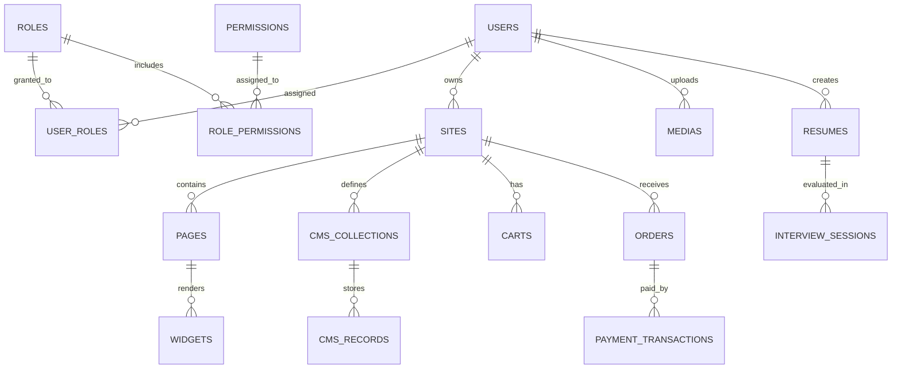

# Database Design

Genzite uses a hybrid **SQL + JSONB** schema pattern on PostgreSQL.

- **Relational tables**: System configuration, identity (Users, Roles, Permissions), and site metadata.
- **JSONB columns**: All user-generated dynamic content, CMS records, resume data, and interview logs.

> **RULE**: NEVER create fixed SQL columns or migrations for dynamic user data fields. All dynamic content MUST use JSONB.

---

## Entity Relationship Diagram

---

## Identity Module

### `users`
| Column | Type | Constraint |
|---|---|---|
| `id` | UUID | PK |
| `email` | VARCHAR(255) | UNIQUE, INDEXED |
| `password_hash` | VARCHAR(255) | NOT NULL |
| `name` | VARCHAR(255) | NOT NULL |
| `avatar_url` | VARCHAR(500) | NULLABLE |
| `credits` | INT | DEFAULT 0 (SaaS Billing Wallet) |
| `created_at` | TIMESTAMP | DEFAULT NOW() |
| `updated_at` | TIMESTAMP | DEFAULT NOW() |

### `roles`
| Column | Type | Constraint |
|---|---|---|
| `id` | UUID | PK |
| `name` | VARCHAR(50) | UNIQUE (e.g., `ADMIN`, `EDITOR`, `VIEWER`, `CANDIDATE`) |
| `description` | VARCHAR(255) | NULLABLE |

### `user_roles`
| Column | Type | Constraint |
|---|---|---|
| `user_id` | UUID | FK → `users.id` |
| `role_id` | UUID | FK → `roles.id` |
| | | PK(user_id, role_id) |

### `permissions`
| Column | Type | Constraint |
|---|---|---|
| `id` | UUID | PK |
| `action` | VARCHAR(100) | NOT NULL (e.g., `site:create`, `cms:write`, `media:upload`) |

### `role_permissions`
| Column | Type | Constraint |
|---|---|---|
| `role_id` | UUID | FK → `roles.id` |
| `permission_id` | UUID | FK → `permissions.id` |
| | | PK(role_id, permission_id) |

---

## Site Module

### `sites`
| Column | Type | Constraint |
|---|---|---|
| `id` | UUID | PK |
| `name` | VARCHAR(255) | NOT NULL |
| `subdomain` | VARCHAR(100) | UNIQUE, INDEXED |
| `description` | TEXT | NULLABLE |
| `owner_id` | UUID | FK → `users.id` |
| `settings` | JSONB | DEFAULT `{}` (theme, favicon, meta tags) |
| `created_at` | TIMESTAMP | DEFAULT NOW() |

### `pages`
| Column | Type | Constraint |
|---|---|---|
| `id` | UUID | PK |
| `site_id` | UUID | FK → `sites.id` |
| `title` | VARCHAR(255) | NOT NULL |
| `slug` | VARCHAR(255) | NOT NULL |
| `sort_order` | INT | DEFAULT 0 |
| `created_at` | TIMESTAMP | DEFAULT NOW() |

### `widgets`
| Column | Type | Constraint |
|---|---|---|
| `id` | UUID | PK |
| `page_id` | UUID | FK → `pages.id` |
| `type` | VARCHAR(50) | NOT NULL (`HEADER`, `HERO`, `CARD`, `TEXT`, `IMAGE`, `FORM`, `FOOTER`) |
| `content_config` | JSONB | NOT NULL (dynamic widget parameters) |
| `sort_order` | INT | DEFAULT 0 |

---

## Data Module (Dynamic CMS)

### `cms_collections`
Defines dynamic schema types built by users or AI.

| Column | Type | Constraint |
|---|---|---|
| `id` | UUID | PK |
| `site_id` | UUID | FK → `sites.id` |
| `name` | VARCHAR(255) | NOT NULL (e.g., `Products`, `BlogPosts`, `Reviews`) |
| `schema_definition` | JSONB | NOT NULL (field names, types, validations) |
| `created_at` | TIMESTAMP | DEFAULT NOW() |

### `cms_records`
Stores actual content records matching collection schemas.

| Column | Type | Constraint |
|---|---|---|
| `id` | UUID | PK |
| `collection_id` | UUID | FK → `cms_collections.id` |
| `data` | JSONB | NOT NULL (freeform keys based on schema_definition) |
| `created_by` | UUID | FK → `users.id` |
| `created_at` | TIMESTAMP | DEFAULT NOW() |
| `updated_at` | TIMESTAMP | DEFAULT NOW() |

---

## Commerce Module

### `carts`
| Column | Type | Constraint |
|---|---|---|
| `id` | UUID | PK |
| `site_id` | UUID | FK → `sites.id` |
| `session_id` | VARCHAR(255) | INDEXED (for guest checkout) |
| `items` | JSONB | NOT NULL (product_id, quantity) |
| `created_at` | TIMESTAMP | DEFAULT NOW() |
| `updated_at` | TIMESTAMP | DEFAULT NOW() |

### `orders`
| Column | Type | Constraint |
|---|---|---|
| `id` | UUID | PK |
| `site_id` | UUID | FK → `sites.id` |
| `order_number` | VARCHAR(50) | UNIQUE, INDEXED |
| `customer_name` | VARCHAR(255) | NOT NULL |
| `customer_email`| VARCHAR(255) | NOT NULL |
| `shipping_address`| TEXT | NULLABLE |
| `items` | JSONB | NOT NULL (product_id, name, price, quantity) |
| `subtotal` | FLOAT | NOT NULL |
| `total` | FLOAT | NOT NULL |
| `payment_method`| VARCHAR(50) | DEFAULT 'COD' |
| `status` | VARCHAR(50) | DEFAULT 'PENDING' (`PAID`, `SHIPPED`) |
| `created_at` | TIMESTAMP | DEFAULT NOW() |
| `updated_at` | TIMESTAMP | DEFAULT NOW() |

### `payment_transactions`
| Column | Type | Constraint |
|---|---|---|
| `id` | UUID | PK |
| `site_id` | UUID | FK → `sites.id` |
| `order_id` | UUID | FK → `orders.id` |
| `gateway` | VARCHAR(50) | NOT NULL (e.g., 'payos') |
| `amount` | FLOAT | NOT NULL |
| `status` | VARCHAR(50) | DEFAULT 'PENDING' (`SUCCESS`, `FAILED`) |
| `created_at` | TIMESTAMP | DEFAULT NOW() |

---

## Media Module

### `medias`
| Column | Type | Constraint |
|---|---|---|
| `id` | UUID | PK |
| `filename` | VARCHAR(255) | NOT NULL |
| `s3_key` | VARCHAR(500) | NOT NULL, UNIQUE |
| `mime_type` | VARCHAR(100) | NOT NULL |
| `size_bytes` | BIGINT | NOT NULL |
| `owner_id` | UUID | FK → `users.id` |
| `created_at` | TIMESTAMP | DEFAULT NOW() |

---

## AI Recruitment Module

### `resumes`
| Column | Type | Constraint |
|---|---|---|
| `id` | UUID | PK |
| `owner_id` | UUID | FK → `users.id` |
| `title` | VARCHAR(255) | NULLABLE |
| `raw_text` | TEXT | NULLABLE (extracted text from uploaded file) |
| `s3_key` | VARCHAR(500) | NULLABLE (uploaded PDF/DOCX reference) |
| `parsed_profile` | JSONB | NULLABLE (structured contact, experience, skills, education) |
| `ats_scores` | JSONB | NULLABLE (JD-matched scoring breakdown) |
| `created_at` | TIMESTAMP | DEFAULT NOW() |
| `updated_at` | TIMESTAMP | DEFAULT NOW() |

### `interview_sessions`
| Column | Type | Constraint |
|---|---|---|
| `id` | UUID | PK |
| `resume_id` | UUID | FK → `resumes.id` |
| `job_description` | TEXT | NOT NULL |
| `session_type` | VARCHAR(50) | NOT NULL (`TECHNICAL`, `BEHAVIORAL`, `MIXED`) |
| `dialogue_history` | JSONB | DEFAULT `[]` (array of `{role, content, timestamp}`) |
| `evaluation` | JSONB | NULLABLE (grades, weaknesses, feedback, study recommendations) |
| `status` | VARCHAR(20) | DEFAULT `IN_PROGRESS` (`IN_PROGRESS`, `COMPLETED`) |
| `created_at` | TIMESTAMP | DEFAULT NOW() |

---

## Caching Layer (Redis)

| Cache Key Pattern | Purpose | TTL |
|---|---|---|
| `session:<userId>` | User session tokens | 24h |
| `site:<siteId>:meta` | Site metadata cache | 5min |
| `cms:<collectionId>:records` | Frequently queried CMS records | 2min |
| `user:<userId>:profile` | User profile cache | 10min |
