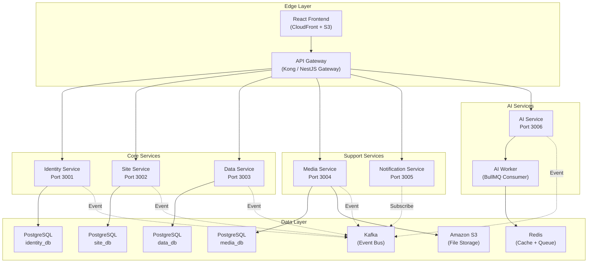

# Genzite – Microservices Architecture Design

> **Status**: Microservices architecture is implemented. All services are located in `apps/`.

---

## 1. Microservice Principles

### Domain-Driven Design (DDD)
Each service represents **an independent business domain**, and can be:
- Developed, deployed, and scaled **independently** from other services.
- Owner of its **own database** (Database-per-Service pattern).
- Communicating with other services **only via API or Events** (never accessing each other's DB directly).

### Golden Rules for Service Splitting
| Rule | Explanation |
|---|---|
| **One service = One business domain** | Do not merge 2 different business domains into 1 service |
| **No Shared Database** | Each service has its own PostgreSQL schema or instance |
| **Asynchronous communication preferred** | Use Kafka Events instead of synchronous HTTP calls when possible |
| **Independent deployments** | Updating Service A does not affect Service B |
| **Shared Library for common code** | DTO types, utils, constants are placed in shared packages |

---

## 2. Genzite Microservices Map



---

## 3. Service Details

### 3.1 Identity Service (Port 3001)
| Attribute | Value |
|---|---|
| **Responsibility** | Registration, Login, JWT, RBAC, User/Role/Permission management |
| **Database** | `identity_db` (users, roles, permissions, user_roles, role_permissions) |
| **Emitted Events** | `UserRegistered`, `UserUpdated`, `RoleAssigned` |
| **Special Note** | The only service that issues JWTs. Other services only **verify** JWTs |

### 3.2 Site Service (Port 3002)
| Attribute | Value |
|---|---|
| **Responsibility** | Sites, Pages, Widgets management (Canvas Builder) |
| **Database** | `site_db` (sites, pages, widgets) |
| **Emitted Events** | `SiteCreated`, `PageUpdated`, `WidgetConfigChanged` |
| **Dependencies** | Needs to verify JWT from Identity Service (via Gateway or shared secret) |

### 3.3 Data Service (Port 3003)
| Attribute | Value |
|---|---|
| **Responsibility** | Dynamic CMS – Collections & Records management (JSONB) |
| **Database** | `data_db` (cms_collections, cms_records) |
| **Emitted Events** | `CollectionCreated`, `RecordCreated`, `RecordUpdated` |
| **Special Note** | All dynamic data is stored in JSONB. No migrations created for user data |

### 3.4 Media Service (Port 3004)
| Attribute | Value |
|---|---|
| **Responsibility** | Generate Presigned URLs for S3, register metadata after upload |
| **Database** | `media_db` (medias) |
| **Emitted Events** | `MediaUploaded`, `MediaDeleted` |
| **Special Note** | Never receives binary files. Only generates URLs and saves metadata |

### 3.5 Notification Service (Port 3005)
| Attribute | Value |
|---|---|
| **Responsibility** | Send Email, Push Notification, In-App Notification |
| **Database** | `notification_db` (notifications, notification_templates) |
| **Listens To** | `UserRegistered` → send Welcome Email, `ResumeAnalyzed` → send results, `InterviewCompleted` → send report |
| **Special Note** | Only **listens** to Kafka events, rarely emits events. Purely a consumer |

### 3.6 AI Service (Port 3006)
| Attribute | Value |
|---|---|
| **Responsibility** | All Google Gemini interactions: site gen, CMS gen, CV analysis, Mock Interview, Career Coaching |
| **Database** | `ai_db` (resumes, interview_sessions) |
| **Emitted Events** | `SiteGenerated`, `CmsGenerated`, `ResumeAnalyzed`, `InterviewCompleted` |
| **Special Note** | Has a dedicated **AI Worker** to asynchronously process heavy tasks via BullMQ/Redis Queue |

---

## 4. Inter-Service Communication

### Synchronous – Via API Gateway
Used for requests where the Frontend needs an immediate response:
```
Frontend → API Gateway → Identity Service (login, fetch profile)
Frontend → API Gateway → Site Service (CRUD pages)
Frontend → API Gateway → Data Service (CRUD records)
```

### Asynchronous – Via Kafka Events
Used for tasks that don't need immediate responses:
```
AI Service  ──publish──▶  Kafka Topic: "resume.analyzed"
                                │
                    ┌───────────┼───────────┐
                    ▼                       ▼
            Notification Service     Data Service
            (send email result)    (update ATS score)
```

### Kafka Topics Table

| Topic | Producer | Consumer(s) |
|---|---|---|
| `user.registered` | Identity | Notification |
| `site.created` | Site | Notification, AI (auto-suggest) |
| `collection.created` | Data | AI (schema validation) |
| `media.uploaded` | Media | Data (attach to record) |
| `resume.submitted` | AI | AI Worker (analyze), Notification |
| `resume.analyzed` | AI Worker | Notification, Data |
| `interview.completed` | AI Worker | Notification |
| `audit.log` | All Services | Analytics Pipeline |

---

## 5. Monorepo Directory Structure Optimized for Microservices

```
genzite/
│
├── .ai/                              # AI agent rules (kept intact)
├── .cursorrules                      # Agent directive (kept intact)
├── docs/                             # Global project documentation
│
├── packages/                         # ========= SHARED LIBRARIES =========
│   ├── shared-types/                 # Shared TypeScript types/interfaces
│   │   ├── src/
│   │   │   ├── dto/                  # Shared DTOs (UserDto, SiteDto, etc.)
│   │   │   ├── events/              # Kafka event payload types
│   │   │   │   ├── user.events.ts
│   │   │   │   ├── site.events.ts
│   │   │   │   └── ai.events.ts
│   │   │   ├── interfaces/          # Shared interfaces
│   │   │   └── constants/           # API routes, error codes, enums
│   │   ├── package.json
│   │   └── tsconfig.json
│   │
│   ├── shared-utils/                 # Shared Helper functions
│   │   ├── src/
│   │   │   ├── jwt.util.ts          # JWT verify helper
│   │   │   ├── pagination.util.ts
│   │   │   └── validation.util.ts
│   │   └── package.json
│   │
│   └── shared-prisma/                # Prisma client wrapper (if splitting schemas)
│       ├── src/
│       └── package.json
│
├── apps/                             # ========= ALL DEPLOYABLE APPS =========
│   ├── gateway/                      # API Gateway (port 3000)
│   │   └── src/
│   │       ├── auth/auth.middleware.ts
│   │       ├── proxy/proxy.controller.ts
│   │       ├── rate-limit/rate-limit.middleware.ts
│   │       ├── app.module.ts
│   │       └── main.ts
│   │
│   ├── identity-service/             # Auth & RBAC (port 3001)
│   │   └── src/
│   │       ├── auth/{dto/, guards/, auth.controller.ts, auth.service.ts}
│   │       ├── users/{dto/, users.controller.ts, users.service.ts}
│   │       ├── entities/identity.entity.ts
│   │       ├── events/identity.producer.ts
│   │       ├── interfaces/identity.interface.ts
│   │       ├── app.module.ts
│   │       └── main.ts
│   │
│   ├── site-service/                 # Canvas Builder (port 3002)
│   │   └── src/{sites/, pages/, widgets/, entities/, events/, interfaces/}
│   │
│   ├── data-service/                 # Dynamic CMS JSONB (port 3003)
│   │   └── src/{collections/, records/, entities/, events/, interfaces/}
│   │
│   ├── media-service/                # S3 Presigned URL (port 3004)
│   │   └── src/{upload/, registry/, entities/, events/, interfaces/}
│   │
│   ├── notification-service/         # Email/Push/In-App (port 3005)
│   │   └── src/{in-app/, email/, push/, consumers/, entities/}
│   │
│   ├── ai-service/                   # Gemini AI (port 3006)
│   │   └── src/{generation/, recruitment/, gemini/, workers/, entities/, events/}
│   │
│   └── frontend/                     # React + Vite + Tailwind CSS
│       └── src/{App.tsx, index.css, main.tsx, assets/}
│
├── infra/                            # ========= INFRASTRUCTURE =========
│   ├── docker-compose.yml
│   └── .env.example
│
├── package.json                      # Root workspace: ["apps/*", "packages/*"]
└── tsconfig.base.json
```

---

## 6. Monorepo Workspace Configuration

The root `package.json` file uses **npm workspaces**:

```json
{
  "name": "genzite",
  "private": true,
  "workspaces": [
    "apps/*",
    "packages/*"
  ],
  "scripts": {
    "dev:gateway": "npm run start:dev --workspace=apps/gateway",
    "dev:identity": "npm run start:dev --workspace=apps/identity-service",
    "dev:site": "npm run start:dev --workspace=apps/site-service",
    "dev:data": "npm run start:dev --workspace=apps/data-service",
    "dev:media": "npm run start:dev --workspace=apps/media-service",
    "dev:notification": "npm run start:dev --workspace=apps/notification-service",
    "dev:ai": "npm run start:dev --workspace=apps/ai-service",
    "dev:frontend": "npm run dev --workspace=apps/frontend"
  }
}
```

---

## 7. Current Status

The Microservices architecture is fully scaffolded:
- ✅ 7 services + 1 frontend in `apps/`
- ✅ Shared types package in `packages/`
- ✅ Docker Compose orchestration in `infra/`
- ❌ Business logic not implemented yet (all placeholders/TODOs)
- ❌ Prisma schema not created yet
- ❌ JWT Auth not integrated yet
- ❌ Gemini API not connected yet
- ❌ Kafka/Redis not set up yet

### Proposed Implementation Order
1. **Identity Service** — JWT auth, password hashing, RBAC
2. **Site Service** — CRUD Sites/Pages/Widgets, Prisma
3. **Data Service** — Dynamic CMS JSONB collections/records
4. **Media Service** — AWS S3 presigned URL
5. **AI Service** — Google Gemini integration
6. **Notification Service** — Kafka consumers, email/push
7. **Gateway** — JWT verification, Redis rate limiting
