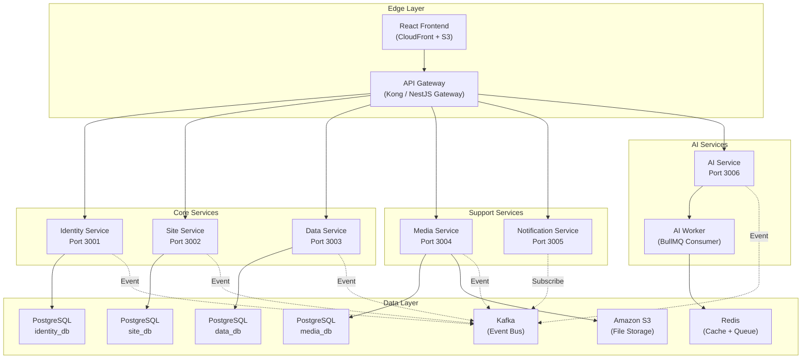

# Genzite – Microservices Architecture Design

> **Trạng thái**: Kiến trúc Microservices đã được triển khai. Tất cả services nằm trong `apps/`.

---

## 1. Nguyên tắc chia Microservice

### Chia theo Domain (Domain-Driven Design)
Mỗi service đại diện cho **một nghiệp vụ kinh doanh độc lập**, có thể:
- Phát triển, triển khai, và mở rộng **độc lập** với các service khác.
- Sở hữu **database riêng** (Database-per-Service pattern).
- Giao tiếp với service khác **chỉ qua API hoặc Event** (không bao giờ truy cập trực tiếp DB của nhau).

### Quy tắc vàng khi tách service
| Quy tắc | Giải thích |
|---|---|
| **Một service = Một domain nghiệp vụ** | Không gộp 2 nghiệp vụ khác nhau vào 1 service |
| **Không chia sẻ Database** | Mỗi service có PostgreSQL schema hoặc instance riêng |
| **Giao tiếp bất đồng bộ ưu tiên** | Dùng Kafka Event thay vì HTTP call đồng bộ khi có thể |
| **Mỗi service triển khai độc lập** | Service A cập nhật không ảnh hưởng Service B |
| **Shared Library cho code dùng chung** | DTO types, utils, constants đặt trong package dùng chung |

---

## 2. Bản đồ Microservices của Genzite



---

## 3. Chi tiết từng Service

### 3.1 Identity Service (Port 3001)
| Thuộc tính | Giá trị |
|---|---|
| **Trách nhiệm** | Đăng ký, đăng nhập, JWT, RBAC, quản lý User/Role/Permission |
| **Database** | `identity_db` (users, roles, permissions, user_roles, role_permissions) |
| **Events phát ra** | `UserRegistered`, `UserUpdated`, `RoleAssigned` |
| **Đặc biệt** | Là service duy nhất phát hành JWT. Các service khác chỉ **xác thực** (verify) JWT |

### 3.2 Site Service (Port 3002)
| Thuộc tính | Giá trị |
|---|---|
| **Trách nhiệm** | Quản lý Sites, Pages, Widgets (Canvas Builder) |
| **Database** | `site_db` (sites, pages, widgets) |
| **Events phát ra** | `SiteCreated`, `PageUpdated`, `WidgetConfigChanged` |
| **Phụ thuộc** | Cần verify JWT từ Identity Service (qua Gateway hoặc shared secret) |

### 3.3 Data Service (Port 3003)
| Thuộc tính | Giá trị |
|---|---|
| **Trách nhiệm** | Dynamic CMS – quản lý Collections & Records (JSONB) |
| **Database** | `data_db` (cms_collections, cms_records) |
| **Events phát ra** | `CollectionCreated`, `RecordCreated`, `RecordUpdated` |
| **Đặc biệt** | Toàn bộ dữ liệu động lưu trong JSONB. Không tạo migration cho user data |

### 3.4 Media Service (Port 3004)
| Thuộc tính | Giá trị |
|---|---|
| **Trách nhiệm** | Sinh Presigned URL cho S3, đăng ký metadata sau upload |
| **Database** | `media_db` (medias) |
| **Events phát ra** | `MediaUploaded`, `MediaDeleted` |
| **Đặc biệt** | Không bao giờ nhận file binary. Chỉ tạo URL và lưu metadata |

### 3.5 Notification Service (Port 3005)
| Thuộc tính | Giá trị |
|---|---|
| **Trách nhiệm** | Gửi Email, Push Notification, In-App Notification |
| **Database** | `notification_db` (notifications, notification_templates) |
| **Events lắng nghe** | `UserRegistered` → gửi Welcome Email, `ResumeAnalyzed` → gửi kết quả, `InterviewCompleted` → gửi báo cáo |
| **Đặc biệt** | Chỉ **lắng nghe** event từ Kafka, gần như không phát ra event. Là consumer thuần túy |

### 3.6 AI Service (Port 3006)
| Thuộc tính | Giá trị |
|---|---|
| **Trách nhiệm** | Tất cả tương tác với Google Gemini: sinh site, sinh CMS, phân tích CV, Mock Interview, Career Coaching |
| **Database** | `ai_db` (resumes, interview_sessions) |
| **Events phát ra** | `SiteGenerated`, `CmsGenerated`, `ResumeAnalyzed`, `InterviewCompleted` |
| **Đặc biệt** | Có thêm **AI Worker** chạy riêng để xử lý bất đồng bộ các tác vụ nặng qua BullMQ/Redis Queue |

---

## 4. Giao tiếp giữa các Service

### Đồng bộ (Synchronous) – Qua API Gateway
Dùng cho các request mà Frontend cần kết quả ngay lập tức:
```
Frontend → API Gateway → Identity Service (login, lấy profile)
Frontend → API Gateway → Site Service (CRUD pages)
Frontend → API Gateway → Data Service (CRUD records)
```

### Bất đồng bộ (Asynchronous) – Qua Kafka Events
Dùng cho các tác vụ không cần trả kết quả ngay:
```
AI Service  ──publish──▶  Kafka Topic: "resume.analyzed"
                                │
                    ┌───────────┼───────────┐
                    ▼                       ▼
            Notification Service     Data Service
            (gửi email kết quả)    (cập nhật ATS score)
```

### Bảng Kafka Topics

| Topic | Producer | Consumer(s) |
|---|---|---|
| `user.registered` | Identity | Notification |
| `site.created` | Site | Notification, AI (auto-suggest) |
| `collection.created` | Data | AI (schema validation) |
| `media.uploaded` | Media | Data (attach to record) |
| `resume.submitted` | AI | AI Worker (analyze), Notification |
| `resume.analyzed` | AI Worker | Notification, Data |
| `interview.completed` | AI Worker | Notification |
| `audit.log` | All Services | Analytics Pipeline |

---

## 5. Cấu trúc thư mục Monorepo tối ưu cho Microservices

```
genzite/
│
├── .ai/                              # AI agent rules (giữ nguyên)
├── .cursorrules                      # Agent directive (giữ nguyên)
├── docs/                             # Tài liệu chung toàn dự án
│
├── packages/                         # ========= SHARED LIBRARIES =========
│   ├── shared-types/                 # TypeScript types/interfaces dùng chung
│   │   ├── src/
│   │   │   ├── dto/                  # Shared DTOs (UserDto, SiteDto, etc.)
│   │   │   ├── events/              # Kafka event payload types
│   │   │   │   ├── user.events.ts
│   │   │   │   ├── site.events.ts
│   │   │   │   └── ai.events.ts
│   │   │   ├── interfaces/          # Shared interfaces
│   │   │   └── constants/           # API routes, error codes, enums
│   │   ├── package.json
│   │   └── tsconfig.json
│   │
│   ├── shared-utils/                 # Helper functions dùng chung
│   │   ├── src/
│   │   │   ├── jwt.util.ts          # JWT verify helper
│   │   │   ├── pagination.util.ts
│   │   │   └── validation.util.ts
│   │   └── package.json
│   │
│   └── shared-prisma/                # Prisma client wrapper (nếu chia schema)
│       ├── src/
│       └── package.json
│
├── apps/                             # ========= ALL DEPLOYABLE APPS =========
│   ├── gateway/                      # API Gateway (port 3000)
│   │   └── src/
│   │       ├── auth/auth.middleware.ts
│   │       ├── proxy/proxy.controller.ts
│   │       ├── rate-limit/rate-limit.middleware.ts
│   │       ├── app.module.ts
│   │       └── main.ts
│   │
│   ├── identity-service/             # Auth & RBAC (port 3001)
│   │   └── src/
│   │       ├── auth/{dto/, guards/, auth.controller.ts, auth.service.ts}
│   │       ├── users/{dto/, users.controller.ts, users.service.ts}
│   │       ├── entities/identity.entity.ts
│   │       ├── events/identity.producer.ts
│   │       ├── interfaces/identity.interface.ts
│   │       ├── app.module.ts
│   │       └── main.ts
│   │
│   ├── site-service/                 # Canvas Builder (port 3002)
│   │   └── src/{sites/, pages/, widgets/, entities/, events/, interfaces/}
│   │
│   ├── data-service/                 # Dynamic CMS JSONB (port 3003)
│   │   └── src/{collections/, records/, entities/, events/, interfaces/}
│   │
│   ├── media-service/                # S3 Presigned URL (port 3004)
│   │   └── src/{upload/, registry/, entities/, events/, interfaces/}
│   │
│   ├── notification-service/         # Email/Push/In-App (port 3005)
│   │   └── src/{in-app/, email/, push/, consumers/, entities/}
│   │
│   ├── ai-service/                   # Gemini AI (port 3006)
│   │   └── src/{generation/, recruitment/, gemini/, workers/, entities/, events/}
│   │
│   └── frontend/                     # React + Vite + Tailwind CSS
│       └── src/{App.tsx, index.css, main.tsx, assets/}
│
├── infra/                            # ========= INFRASTRUCTURE =========
│   ├── docker-compose.yml
│   └── .env.example
│
├── package.json                      # Root workspace: ["apps/*", "packages/*"]
└── tsconfig.base.json
```

---

## 6. Monorepo Workspace Configuration

File `package.json` ở gốc sử dụng **npm workspaces**:

```json
{
  "name": "genzite",
  "private": true,
  "workspaces": [
    "apps/*",
    "packages/*"
  ],
  "scripts": {
    "dev:gateway": "npm run start:dev --workspace=apps/gateway",
    "dev:identity": "npm run start:dev --workspace=apps/identity-service",
    "dev:site": "npm run start:dev --workspace=apps/site-service",
    "dev:data": "npm run start:dev --workspace=apps/data-service",
    "dev:media": "npm run start:dev --workspace=apps/media-service",
    "dev:notification": "npm run start:dev --workspace=apps/notification-service",
    "dev:ai": "npm run start:dev --workspace=apps/ai-service",
    "dev:frontend": "npm run dev --workspace=apps/frontend"
  }
}
```

---

## 7. Trạng thái hiện tại

Kiến trúc Microservices đã được triển khai đầy đủ:
- ✅ 7 services + 1 frontend trong `apps/`
- ✅ Shared types package trong `packages/`
- ✅ Docker Compose orchestration trong `infra/`
- ❌ Logic nghiệp vụ chưa implement (tất cả đang là placeholder/TODO)
- ❌ Prisma schema chưa tạo
- ❌ JWT Auth chưa tích hợp
- ❌ Gemini API chưa kết nối
- ❌ Kafka/Redis chưa setup

### Thứ tự implement đề xuất
1. **Identity Service** — JWT auth, password hashing, RBAC
2. **Site Service** — CRUD Sites/Pages/Widgets, Prisma
3. **Data Service** — Dynamic CMS JSONB collections/records
4. **Media Service** — AWS S3 presigned URL
5. **AI Service** — Google Gemini integration
6. **Notification Service** — Kafka consumers, email/push
7. **Gateway** — JWT verification, Redis rate limiting
