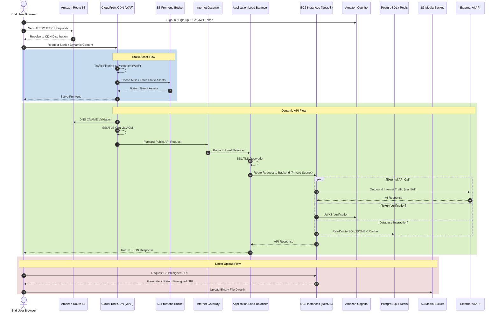

# Genzite Project Overview

## 1. Product Objective

Genzite is a next-generation AI No-Code platform that allows non-technical users to create and operate fully functional web applications using natural language.

Instead of just generating static website interfaces, Genzite automatically generates:
- Frontend user interfaces
- Backend APIs
- Dynamic CMS data structures
- Business workflows
- AI-powered business features

Users simply describe their requirements in natural language (e.g., *"Create an online flower shop website"* or *"Create an AI CV Builder"*). The system utilizes a Dual-LLM architecture (Google Gemini & Groq Llama3) to analyze requirements and automatically generate the appropriate application structure, data schema, and UI.

---

## 2. Core Business Goals

### 2.1. AI Website & Application Generation
Enables users to create various types of applications without writing source code:
- E-commerce Websites
- Recruitment Portals
- Learning Management Systems (LMS)
- Internal Business Dashboards

### 2.2. Dynamic CMS with JSONB Architecture
The system supports dynamic data modeling through PostgreSQL JSONB. Users can create and modify forms, content types, and business objects on the fly during runtime without requiring database migrations.

### 2.3. AI Recruitment Intelligence
- **AI CV Builder**: Create and publish CVs from experience descriptions.
- **AI CV Analysis**: Upload CV + Job Description to analyze compatibility match, calculate ATS Score, and detect missing skills.
- **AI Mock Interview**: AI acts as the interviewer, generating position-specific questions, scoring candidate responses in real-time, and providing improvement feedback.

### 2.4. E-Commerce & SaaS Billing
B2B2C payment system integrating PayOS. Customer payments are routed directly to merchants, while the platform automatically deducts SaaS service credits via secure Microservices communication.

---

## 3. Tech Stack

- **Frontend**: React 18, Vite, TypeScript, Tailwind CSS v4. Features a Decoupled Architecture with over 15+ dynamic widgets.
- **Backend (Microservices)**: Built with NestJS and Prisma ORM. The system is split into 8 core services communicating asynchronously via Kafka and synchronously via API Gateway.
- **Database**: PostgreSQL (Hybrid architecture: Relational SQL for system data, JSONB for No-Code dynamic data).
- **Cache & Queue**: Redis, BullMQ (managing queues for heavy LLM jobs).
- **AI Engine**: Google Gemini API, Groq (Llama3) for high-speed UX auditing, and Model Context Protocol (MCP SDK).
- **Infrastructure**: AWS Cloud-Native (EC2, S3, RDS, ElastiCache, ALB, CloudFront).

---

## 4. System Data Flow Diagram

The following diagram illustrates the complete 17-step data flow from the external user request down to the internal AWS infrastructure and Database layer.

