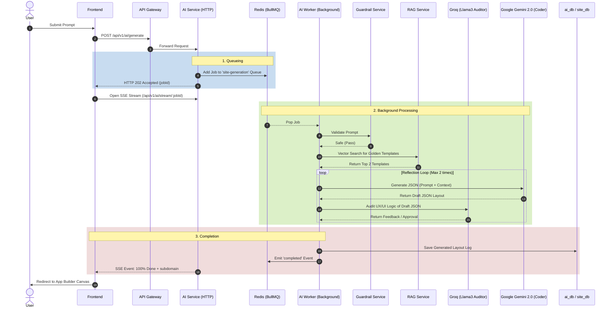
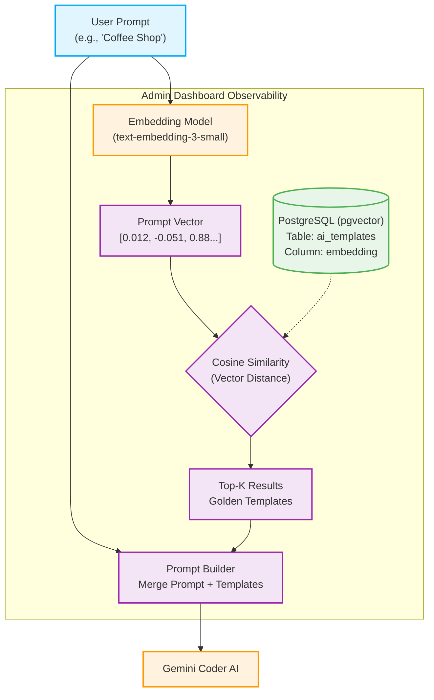

# Automated Site Creation Flow

This document details the step-by-step background process when a user creates a new website on the Genzite platform, with a special emphasis on the **AI-Driven Generation Flow**.

---

## 1. AI Prompt-Driven Generation Flow

This is the core scenario of the Genzite No-Code system when a user inputs a prompt like: *"Create a coffee shop website for me..."*.

### Flow Diagram

### Detailed Steps

#### Step 1: Request Intake (HTTP)
* The user sends a Prompt from the Frontend to the API Gateway.
* The Gateway authenticates and forwards the request to the `GenerationController` in the **AI Service**.

#### Step 2: Queueing & Asynchronous Processing
* Calling AI services takes time, so the system does not force the user to wait for a synchronous HTTP request. Instead, the API pushes this Job into the **BullMQ** queue (on Redis) (Queue: `site-generation`).
* The API immediately returns an `HTTP 202 Accepted` status along with a unique `jobId`.

#### Step 3: Progress Streaming (SSE Stream)
* The Frontend uses the received `jobId` to open a **Server-Sent Events (SSE)** connection to `/api/v1/ai/stream/:jobId`.
* Through SSE, the Frontend continuously receives progress percentages (%) and displays a real-time Loading UI to the user.

#### Step 4: Security Guardrail
* In the background, the **AI Worker** pops the Job from the queue for processing.
* The system calls the `GuardrailService` to check if the input Prompt contains malicious, sensitive, or attack-oriented content (Prompt Injection).
* If a violation is detected, the Job is immediately aborted.

#### Step 5: Intelligent Template Extraction (RAG System)
* Calls `RagService` to perform a vector search in the Database using the user's prompt to extract **"Golden Templates"** (the most standard UX/UI structures for that website category).
* Purpose: To inject this context into the AI so it doesn't design randomly.

#### Step 6: AI Engineer Design (Coder AI Generation)
* The system calls the **Google Gemini LLM** API (acting as the Coder).
* The Coder AI analyzes the Prompt + Golden Templates to generate the entire web layout as a JSON string.
* The JSON includes: Website Name, Subdomain, a list of Pages, and an array of pre-arranged user interface elements (Widgets).

#### Step 7: UX Expert Audit (Auditor AI Reflection)
* To mitigate AI hallucination and structural errors, the JSON from Step 6 is sent to a second, ultra-fast LLM, **Groq / Llama3** (acting as the Auditor).
* If the design contains UX/UI logic errors, the Auditor returns warning feedback.
* The Coder AI (Gemini) receives the feedback and **automatically revises the design**. This reflection loop runs automatically a maximum of 2 times.

#### Step 8: Completion & Return
* The final design that passes the audit is logged in the DB (`ai_task_logs` table).
* A `completed` event is triggered on BullMQ. The SSE stream pushes a `100% Done` notification along with the `subdomain` to the Frontend.
* The Frontend automatically redirects the user to the **App Builder Canvas** interface with the completed design.

---

## 2. Core Site Storage Flow (Core Site Service)

After the AI generates the JSON design (or if the user manually creates a blank site), the data is sent to `site-service` to be officially stored in the Database.

* **Step 1: Validate Information**
  * The system checks the validity and uniqueness of the `subdomain`. If it's already taken, it returns a `ConflictException`.
* **Step 2: Write to Database**
  * Uses **Prisma ORM** to INSERT the website data into `site_db` (`Site` table).
  * Assigns the `ownerId` attribute to grant ownership to the current user.
* **Step 3: Emit Event (Kafka Event-Driven)**
  * Calls `SiteProducer` to push a `SiteCreated` event into the **Apache Kafka** Message Broker.
* **Step 4: Other Services React (Background Sync)**
  * Thanks to Kafka, other services automatically know a new site was just created without interrupting the main API flow:
    * **AI Service (Hybrid UI Generation):** The AI Worker listens for the `SiteCreated` event. It automatically connects with `site-service` to generate mandatory system pages for the Shop owner without requiring manual user input. Specifically:
      - Creates an `/admin` page: Automatically embeds the `AdminPanel` widget, allowing the shop owner to top-up Credits and view the CMS grid (`OrderTable`).
      - Creates a `/payment-result` page: Automatically embeds the `PaymentStatus` widget to display a thank-you screen when a customer successfully pays via PayOS.
    * **Notification Service:** Listens to the event to send a welcome/congratulatory email or in-app notification to the user.

---

## 3. Future Upgrade: True Vector RAG Architecture

Currently, the `RagService` uses Keyword Matching. To enhance AI precision, Genzite plans to implement a true Vector Database (using `pgvector`) and an Embedding Model. The following diagram illustrates how this architecture will work and can be displayed in the Admin Dashboard for observability.

